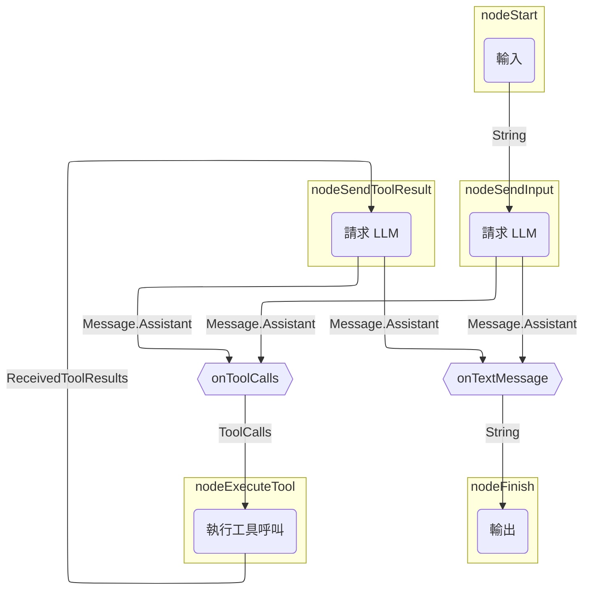
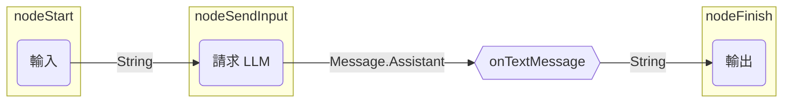

# 基於圖形的代理

使用基於圖形的代理，您可以將行為建模為一個明確的狀態機：
策略圖的節點代表操作（LLM 呼叫、工具執行），
而邊則代表節點之間的資料流。

基於圖形的代理之主要優點包括：

- 易於視覺化
- 狀態持久化
- 可組合架構

??? note "先決條件"

    --8<-- "quickstart-snippets.md:prerequisites"

    --8<-- "quickstart-snippets.md:dependencies"

    --8<-- "quickstart-snippets.md:api-key"

    本頁面的範例假設您正透過 Ollama 在本機執行 Llama 3.2。

本頁面說明如何重新建立 [基本代理](basic-agents.md) 中使用的策略圖。
它會向 LLM 發送請求，然後輸出回應（如果 LLM 回應的是助理訊息）
或執行工具（如果 LLM 要求進行工具呼叫）。
在工具呼叫的情況下，代理會將工具結果發送給 LLM，
然後輸出回應或執行另一個工具。

這是該策略圖的示意圖：


<!--- KNIT example-graph-agents-01.txt -->

## 組建策略圖

在 Koog 中，您可以使用 [`AIAgentGraphStrategyBuilder`](https://api.koog.ai/agents/agents-core/ai.koog.agents.core.dsl.builder/-a-i-agent-graph-strategy-builder/index.html) 來實作策略。
就像每個節點都有輸入和輸出型別一樣，
策略整體也會定義特定的輸入和輸出型別。
本範例假設輸入和輸出型別都是字串，
這意味著實作此策略的代理將預期接收一個字串並回傳一個字串。

要建立策略，請使用 [`strategy()`](https://api.koog.ai/agents/agents-core/ai.koog.agents.core.dsl.builder/strategy.html) 函式，並指定兩個泛型作為輸入和輸出型別，
為策略提供唯一的識別符號，並定義節點與邊。

=== "Kotlin"

    <!--- INCLUDE
    import ai.koog.agents.core.dsl.builder.forwardTo
    import ai.koog.agents.core.dsl.builder.strategy
    import ai.koog.agents.core.dsl.extension.*
    -->
    ```kotlin
    val calculatorAgentStrategy = strategy<String, String>("Simple calculator") {
        val nodeSendInput by nodeLLMRequest()
        val nodeExecuteTool by nodeExecuteToolsAndGetResults()
        val nodeSendToolResult by nodeLLMSendToolResults()
        
        edge(nodeStart forwardTo nodeSendInput asUserMessage { it })
        edge(nodeSendInput forwardTo nodeFinish onTextMessage { true })
        edge(nodeSendInput forwardTo nodeExecuteTool onToolCalls { true })
        edge(nodeExecuteTool forwardTo nodeSendToolResult)
        edge(nodeSendToolResult forwardTo nodeFinish onTextMessage { true })
        edge(nodeSendToolResult forwardTo nodeExecuteTool onToolCalls { true })
    }
    ```
    <!--- KNIT example-graph-agents-01.kt -->

=== "Java"

    <!--- INCLUDE
    import ai.koog.agents.core.agent.entity.AIAgentEdge;
    import ai.koog.agents.core.agent.entity.AIAgentGraphStrategy;
    import ai.koog.agents.core.agent.entity.AIAgentNode;
    import ai.koog.prompt.message.Message;
    import ai.koog.prompt.message.MessagePart;
    import java.util.stream.Collectors;
    class exampleGraphAgentsJava01 {
        public static void main(String[] args) {
    -->
    <!--- SUFFIX
        }
    }
    -->
    ```java
    var calculatorAgentStrategy = AIAgentGraphStrategy.builder("Simple calculator")
        .withInput(String.class)
        .withOutput(String.class);

    var nodeSendInput = AIAgentNode.llmRequest("nodeSendInput");
    var nodeExecuteTool = AIAgentNode.executeTools("nodeExecuteTool");
    var nodeSendToolResult = AIAgentNode.llmRequest("nodeSendToolResult");

    calculatorAgentStrategy.edge(AIAgentEdge.builder()
        .from(calculatorAgentStrategy.nodeStart)
        .to(nodeSendInput)
        .asUserMessage(input -> input)
        .build());
    calculatorAgentStrategy.edge(AIAgentEdge.builder()
        .from(nodeSendInput)
        .to(calculatorAgentStrategy.nodeFinish)
        .onTextMessage()
        .build());
    calculatorAgentStrategy.edge(AIAgentEdge.builder()
        .from(nodeSendInput)
        .to(nodeExecuteTool)
        .onToolCalls(call -> true)
        .build());
    calculatorAgentStrategy.edge(nodeExecuteTool, nodeSendToolResult);
    calculatorAgentStrategy.edge(AIAgentEdge.builder()
        .from(nodeSendToolResult)
        .to(calculatorAgentStrategy.nodeFinish)
        .onTextMessage()
        .build());
    calculatorAgentStrategy.edge(AIAgentEdge.builder()
        .from(nodeSendToolResult)
        .to(nodeExecuteTool)
        .onToolCalls(call -> true)
        .build());
    ```
    <!--- KNIT exampleGraphAgentsJava01.java -->

此範例僅使用 [預定義節點](../nodes-and-components.md)，
但您也可以建立 [自訂節點](../custom-nodes.md)。

每個策略圖都必須有一條從 `nodeStart` 到 `nodeFinish` 並由 [邊](../custom-strategy-graphs.md#edges) 連接的路徑。
邊可以包含條件，以決定何時遵循特定的邊。
邊也可以在將前一個節點的輸出傳遞給下一個節點之前對其進行轉換。
這對於連接輸出與輸入型別不匹配的節點是必要的。

在前面的範例中，`onToolCalls { true }` 意指只有在前一個節點回傳包含至少一個工具呼叫 (`MessagePart.Tool.Call`) 的助理訊息時，才會遵循該邊。

當使用 `onTextMessage { true }` 時，只有在前一個節點回傳包含文字部分 (`MessagePart.Text`) 的助理訊息時，才會遵循該邊。
此函式還會提取並連接這些部分的文字內容，
有效地將 `Message.Assistant` 轉換為 `String`，因為 `nodeFinish` 預期接收一個字串。

!!! tip

    除了 `onTextMessage { true }`，您也可以執行以下操作：

    <!--- INCLUDE
    import ai.koog.prompt.message.MessagePart
    /**
    -->
    <!--- SUFFIX
    **/
    -->
    ```kotlin
    onMessageParts(MessagePart.Text::class) transformed { it.joinToString("
") { part -> part.text } }
    ```
    <!--- KNIT example-graph-agents-02.kt -->

    或者：

    <!--- INCLUDE
    import ai.koog.prompt.message.Message
    import ai.koog.prompt.message.MessagePart
    /**
    -->
    <!--- SUFFIX
    **/
    -->
    ```kotlin
    onCondition { it is Message.Assistant } transformed { (it as Message.Assistant).parts.filterIsInstance<MessagePart.Text>().joinToString("
") { part -> part.text } }
    ```
    <!--- KNIT example-graph-agents-03.kt -->

## 建立並執行代理

讓我們使用此策略建立一個代理執行個體並執行它：

=== "Kotlin"

    <!--- INCLUDE
    import ai.koog.agents.core.agent.AIAgent
    import ai.koog.agents.core.dsl.builder.forwardTo
    import ai.koog.agents.core.dsl.builder.strategy
    import ai.koog.agents.core.dsl.extension.*
    import ai.koog.agents.core.dsl.extension.nodeExecuteToolsAndGetResults
    import ai.koog.agents.core.dsl.extension.nodeLLMRequest
    import ai.koog.agents.core.dsl.extension.nodeLLMSendToolResults
    import ai.koog.prompt.executor.llms.all.simpleOllamaAIExecutor
    import ai.koog.prompt.executor.ollama.client.OllamaModels
    import kotlinx.coroutines.runBlocking
    -->
    ```kotlin
    val calculatorAgentStrategy = strategy<String, String>("Simple calculator") {
        val nodeSendInput by nodeLLMRequest()
        val nodeExecuteTool by nodeExecuteToolsAndGetResults()
        val nodeSendToolResult by nodeLLMSendToolResults()
    
        edge(nodeStart forwardTo nodeSendInput asUserMessage { it })
        edge(nodeSendInput forwardTo nodeFinish onTextMessage { true })
        edge(nodeSendInput forwardTo nodeExecuteTool onToolCalls { true })
        edge(nodeExecuteTool forwardTo nodeSendToolResult)
        edge(nodeSendToolResult forwardTo nodeFinish onTextMessage { true })
        edge(nodeSendToolResult forwardTo nodeExecuteTool onToolCalls { true })
    }
    
    val mathAgent = AIAgent(
        promptExecutor = simpleOllamaAIExecutor(),
        llmModel = OllamaModels.Meta.LLAMA_3_2,
        strategy = calculatorAgentStrategy
    )
    
    fun main() = runBlocking {
        val result = mathAgent.run("Multiply 3 by 4, then multiply the result by 5, then add 10, then add 123.")
        println(result)
    }
    ```
    <!--- KNIT example-graph-agents-04.kt -->

=== "Java"

    <!--- INCLUDE
    import ai.koog.agents.core.agent.AIAgent;
    import ai.koog.agents.core.agent.entity.AIAgentEdge;
    import ai.koog.agents.core.agent.entity.AIAgentGraphStrategy;
    import ai.koog.agents.core.agent.entity.AIAgentNode;
    import ai.koog.prompt.executor.ollama.client.OllamaModels;
    import ai.koog.prompt.message.Message;
    import ai.koog.prompt.message.MessagePart;
    import ai.koog.prompt.executor.model.PromptExecutor;
    import java.util.stream.Collectors;
    class exampleGraphAgentsJava02 {
        public static void main(String[] args) {
    -->
    <!--- SUFFIX
        }
    }
    -->
    ```java
    var calculatorAgentStrategy = AIAgentGraphStrategy.builder("Simple calculator")
        .withInput(String.class)
        .withOutput(String.class);

    var nodeSendInput = AIAgentNode.llmRequest("nodeSendInput");
    var nodeExecuteTool = AIAgentNode.executeTools("nodeExecuteTool");
    var nodeSendToolResult = AIAgentNode.llmRequest("nodeSendToolResult");

    calculatorAgentStrategy.edge(AIAgentEdge.builder()
        .from(calculatorAgentStrategy.nodeStart)
        .to(nodeSendInput)
        .asUserMessage(input -> input)
        .build());
    calculatorAgentStrategy.edge(AIAgentEdge.builder()
        .from(nodeSendInput)
        .to(calculatorAgentStrategy.nodeFinish)
        .onTextMessage()
        .build());
    calculatorAgentStrategy.edge(AIAgentEdge.builder()
        .from(nodeSendInput)
        .to(nodeExecuteTool)
        .onToolCalls(call -> true)
        .build());
    calculatorAgentStrategy.edge(nodeExecuteTool, nodeSendToolResult);
    calculatorAgentStrategy.edge(AIAgentEdge.builder()
        .from(nodeSendToolResult)
        .to(calculatorAgentStrategy.nodeFinish)
        .onTextMessage()
        .build());
    calculatorAgentStrategy.edge(AIAgentEdge.builder()
        .from(nodeSendToolResult)
        .to(nodeExecuteTool)
        .onToolCalls(call -> true)
        .build());

    var promptExecutor = PromptExecutor.builder()
        .ollama("http://localhost:11434")
        .build();

    AIAgent<String, String> mathAgent = AIAgent.builder()
        .promptExecutor(promptExecutor)
        .llmModel(OllamaModels.Meta.LLAMA_3_2)
        .graphStrategy(calculatorAgentStrategy.build())
        .build();

        String result = mathAgent.run("Multiply 3 by 4, then multiply the result by 5, then add 10, then add 123.", null);
        System.out.println(result);
    ```
    <!--- KNIT exampleGraphAgentsJava02.java -->

當您執行此代理時，它將會回應類似以下的內容：

```text
To calculate this, I'll follow the order of operations:

1. Multiply 3 by 4: 3 * 4 = 12
2. Multiply the result by 5: 12 * 5 = 60
3. Add 10: 60 + 10 = 70
4. Add 123: 70 + 123 = 193

The final answer is 193.
```
<!--- KNIT example-graph-agents-02.txt -->

然而，由於此代理沒有任何工具，LLM 永遠不會回傳工具呼叫，而只是簡單地產生整個答案。實際發生的情況如下：


<!--- KNIT example-graph-agents-03.txt -->

儘管在這種情況下結果是正確的，但答案將取決於底層 LLM 的算術能力。為了確保計算準確，我們應該為代理提供數學工具。這樣一來，LLM 就能夠決定呼叫工具來以確定性的方式執行計算。

## 新增工具

定義用於執行數學運算的 [工具](../tools-overview.md)，並將其新增至 [ToolRegistry](https://api.koog.ai/agents/agents-tools/ai.koog.agents.core.tools/-tool-registry/index.html)：

=== "Kotlin"

    <!--- INCLUDE
    import ai.koog.agents.core.tools.ToolRegistry
    import ai.koog.agents.core.tools.annotations.LLMDescription
    import ai.koog.agents.core.tools.annotations.Tool
    import ai.koog.agents.core.tools.reflect.ToolSet
    -->
    ```kotlin
    @LLMDescription("用於執行數學運算的工具")
    class MathTools : ToolSet {
        @Tool
        @LLMDescription("將兩個數字相加並回傳結果")
        fun add(a: Int, b: Int): Int {
            // 這不是必須的，但有助於在主控台輸出中查看工具呼叫
            println("正在相加 $a 和 $b...")
            return a + b
        }
        @Tool
        @LLMDescription("將兩個數字相乘並回傳結果")
        fun multiply(a: Int, b: Int): Int {
            // 這不是必須的，但有助於在主控台輸出中查看工具呼叫
            println("正在相乘 $a 和 $b...")
            return a * b
        }
    }
    
    val toolRegistry = ToolRegistry {
        tools(MathTools())
    }
    ```
    <!--- KNIT example-graph-agents-05.kt -->

=== "Java"

    <!--- INCLUDE
    import ai.koog.agents.core.tools.ToolRegistry;
    import ai.koog.agents.core.tools.annotations.LLMDescription;
    import ai.koog.agents.core.tools.annotations.Tool;
    import ai.koog.agents.core.tools.reflect.ToolSet;
    import static ai.koog.prompt.executor.llms.all.SimplePromptExecutors.simpleOllamaAIExecutor;
    class exampleGraphAgentsJava03 {
    -->
    <!--- SUFFIX
    }
    -->
    ```java
    @LLMDescription("用於執行數學運算的工具")
    public static class MathTools implements ToolSet {
        @Tool
        @LLMDescription("將兩個數字相加並回傳結果")
        public int add(int a, int b) {
            // 這不是必須的，但有助於在主控台輸出中查看工具呼叫
            System.out.println("Adding " + a + " and " + b + "...");
            return a + b;
        }

        @Tool
        @LLMDescription("將兩個數字相乘並回傳結果")
        public int multiply(int a, int b) {
            // 這不是必須的，但有助於在主控台輸出中查看工具呼叫
            System.out.println("Multiplying " + a + " and " + b + "...");
            return a * b;
        }
    }
    public static void main(String[] args) {
        ToolRegistry toolRegistry = ToolRegistry.builder()
            .tools(new MathTools())
            .build();
    }
    ```
    <!--- KNIT exampleGraphAgentsJava03.java -->

將工具註冊表新增至代理配置中：

=== "Kotlin"

    <!--- INCLUDE
    import ai.koog.agents.core.agent.AIAgent
    import ai.koog.agents.core.dsl.builder.forwardTo
    import ai.koog.agents.core.dsl.builder.strategy
    import ai.koog.agents.core.dsl.extension.*
    import ai.koog.agents.core.dsl.extension.nodeExecuteToolsAndGetResults
    import ai.koog.agents.core.dsl.extension.nodeLLMRequest
    import ai.koog.agents.core.dsl.extension.nodeLLMSendToolResults
    import ai.koog.agents.core.tools.ToolRegistry
    import ai.koog.agents.core.tools.annotations.LLMDescription
    import ai.koog.agents.core.tools.annotations.Tool
    import ai.koog.agents.core.tools.reflect.ToolSet
    import ai.koog.prompt.executor.llms.all.simpleOllamaAIExecutor
    import ai.koog.prompt.executor.ollama.client.OllamaModels
    import kotlinx.coroutines.runBlocking
    
    @LLMDescription("用於執行數學運算的工具")
    class MathTools : ToolSet {
        @Tool
        @LLMDescription("將兩個數字相加並回傳結果")
        fun add(a: Int, b: Int): Int {
            // 這不是必須的，但有助於在主控台輸出中查看工具呼叫
            println("正在相加 $a 和 $b...")
            return a + b
        }
        @Tool
        @LLMDescription("將兩個數字相乘並回傳結果")
        fun multiply(a: Int, b: Int): Int {
            // 這不是必須的，但有助於在主控台輸出中查看工具呼叫
            println("正在相乘 $a 和 $b...")
            return a * b
        }
    }
    
    val toolRegistry = ToolRegistry {
        tools(MathTools())
    }
    
    val calculatorAgentStrategy = strategy<String, String>("Simple calculator") {
        val nodeSendInput by nodeLLMRequest()
        val nodeExecuteTool by nodeExecuteToolsAndGetResults()
        val nodeSendToolResult by nodeLLMSendToolResults()
    
        edge(nodeStart forwardTo nodeSendInput asUserMessage { it })
        edge(nodeSendInput forwardTo nodeFinish onTextMessage { true })
        edge(nodeSendInput forwardTo nodeExecuteTool onToolCalls { true })
        edge(nodeExecuteTool forwardTo nodeSendToolResult)
        edge(nodeSendToolResult forwardTo nodeFinish onTextMessage { true })
        edge(nodeSendToolResult forwardTo nodeExecuteTool onToolCalls { true })
    }
    -->
    ```kotlin
    val mathAgent = AIAgent(
        promptExecutor = simpleOllamaAIExecutor(),
        llmModel = OllamaModels.Meta.LLAMA_3_2,
        strategy = calculatorAgentStrategy,
        toolRegistry = toolRegistry
    )
    
    fun main() = runBlocking {
        val result = mathAgent.run("Multiply 3 by 4, then multiply the result by 5, then add 10, then add 123.")
        println(result)
    }
    ```
    <!--- KNIT example-graph-agents-06.kt -->

=== "Java"

    <!--- INCLUDE
    import ai.koog.agents.core.agent.AIAgent;
    import ai.koog.agents.core.agent.entity.AIAgentEdge;
    import ai.koog.agents.core.agent.entity.AIAgentGraphStrategy;
    import ai.koog.agents.core.agent.entity.AIAgentNode;
    import ai.koog.agents.core.tools.ToolRegistry;
    import ai.koog.agents.core.tools.annotations.LLMDescription;
    import ai.koog.agents.core.tools.annotations.Tool;
    import ai.koog.agents.core.tools.reflect.ToolSet;
    import ai.koog.prompt.executor.ollama.client.OllamaModels;
    import ai.koog.prompt.message.Message;
    import ai.koog.prompt.message.MessagePart;
    import ai.koog.prompt.executor.model.PromptExecutor;
    import java.util.stream.Collectors;
    class exampleGraphAgentsJava04 {
        @LLMDescription("用於執行數學運算的工具")
        public static class MathTools implements ToolSet {
            @Tool
            @LLMDescription("將兩個數字相加並回傳結果")
            public int add(int a, int b) {
                // 這不是必須的，但有助於在主控台輸出中查看工具呼叫
                System.out.println("Adding " + a + " and " + b + "...");
                return a + b;
        }
            @Tool
            @LLMDescription("將兩個數字相乘並回傳結果")
            public int multiply(int a, int b) {
                // 這不是必須的，但有助於在主控台輸出中查看工具呼叫
                System.out.println("Multiplying " + a + " and " + b + "...");
                return a * b;
            }
        }
        public static void main(String[] args) {
            ToolRegistry toolRegistry = ToolRegistry.builder()
                .tools(new MathTools())
                .build();
            var calculatorAgentStrategy = AIAgentGraphStrategy.builder("Simple calculator")
                .withInput(String.class)
                .withOutput(String.class);
            var nodeSendInput = AIAgentNode.llmRequest("nodeSendInput");
            var nodeExecuteTool = AIAgentNode.executeTools("nodeExecuteTool");
            var nodeSendToolResult = AIAgentNode.llmRequest("nodeSendToolResult");
            calculatorAgentStrategy.edge(AIAgentEdge.builder()
                .from(calculatorAgentStrategy.nodeStart)
                .to(nodeSendInput)
                .asUserMessage(input -> input)
                .build());
            calculatorAgentStrategy.edge(AIAgentEdge.builder()
                .from(nodeSendInput)
                .to(calculatorAgentStrategy.nodeFinish)
                .onTextMessage()
                .build());
            calculatorAgentStrategy.edge(AIAgentEdge.builder()
                .from(nodeSendInput)
                .to(nodeExecuteTool)
                .onToolCalls(call -> true)
                .build());
            calculatorAgentStrategy.edge(nodeExecuteTool, nodeSendToolResult);
            calculatorAgentStrategy.edge(AIAgentEdge.builder()
                .from(nodeSendToolResult)
                .to(calculatorAgentStrategy.nodeFinish)
                .onTextMessage()
                .build());
            calculatorAgentStrategy.edge(AIAgentEdge.builder()
                .from(nodeSendToolResult)
                .to(nodeExecuteTool)
                .onToolCalls(call -> true)
                .build());
            var promptExecutor = PromptExecutor.builder()
                .ollama("http://localhost:11434")
                .build();
    -->
    <!--- SUFFIX
        }
    }
    -->
    ```java
    AIAgent<String, String> mathAgent = AIAgent.builder()
        .promptExecutor(promptExecutor)
        .llmModel(OllamaModels.Meta.LLAMA_3_2)
        .graphStrategy(calculatorAgentStrategy.build())
        .toolRegistry(toolRegistry)
        .build();

    String result = mathAgent.run("Multiply 3 by 4, then multiply the result by 5, then add 10, then add 123.", null);
    System.out.println(result);
    ```
    <!--- KNIT exampleGraphAgentsJava04.java -->

現在當您執行代理時，它將會回應類似以下的內容：

```text
Multiplying 3 and 4...
The output from the first operation was multiplied by 5:
5 * 12 = 60

Then, 10 was added to the result:
60 + 10 = 70

Finally, 123 was added to the result:
70 + 123 = 193
```
<!--- KNIT example-graph-agents-04.txt -->

根據此輸出，代理正確地執行了計算，但它只呼叫了一次 `multiply` 工具，而不是針對每個運算呼叫對應的工具。我們可以透過描述代理的角色並在系統提示中提供使用適當工具的指令來協助代理。

## 提供系統提示

[系統提示](../prompts/prompt-creation/index.md#system-message) 定義了代理的角色以及執行任務的指令。在我們的範例中，描述代理應如何處理複雜的多步驟計算非常重要：

=== "Kotlin"

    <!--- INCLUDE
    import ai.koog.agents.core.agent.AIAgent
    import ai.koog.agents.core.dsl.builder.forwardTo
    import ai.koog.agents.core.dsl.builder.strategy
    import ai.koog.agents.core.dsl.extension.*
    import ai.koog.agents.core.dsl.extension.nodeExecuteToolsAndGetResults
    import ai.koog.agents.core.dsl.extension.nodeLLMRequest
    import ai.koog.agents.core.dsl.extension.nodeLLMSendToolResults
    import ai.koog.agents.core.tools.ToolRegistry
    import ai.koog.agents.core.tools.annotations.LLMDescription
    import ai.koog.agents.core.tools.annotations.Tool
    import ai.koog.agents.core.tools.reflect.ToolSet
    import ai.koog.prompt.executor.llms.all.simpleOllamaAIExecutor
    import ai.koog.prompt.executor.ollama.client.OllamaModels
    import kotlinx.coroutines.runBlocking
    
    @LLMDescription("用於執行數學運算的工具")
    class MathTools : ToolSet {
        @Tool
        @LLMDescription("將兩個數字相加並回傳結果")
        fun add(a: Int, b: Int): Int {
            // 這不是必須的，但有助於在主控台輸出中查看工具呼叫
            println("正在相加 $a 和 $b...")
            return a + b
        }
        @Tool
        @LLMDescription("將兩個數字相乘並回傳結果")
        fun multiply(a: Int, b: Int): Int {
            // 這不是必須的，但有助於在主控台輸出中查看工具呼叫
            println("正在相乘 $a 和 $b...")
            return a * b
        }
    }
    
    val toolRegistry = ToolRegistry {
        tools(MathTools())
    }
    
    val calculatorAgentStrategy = strategy<String, String>("Simple calculator") {
        val nodeSendInput by nodeLLMRequest()
        val nodeExecuteTool by nodeExecuteToolsAndGetResults()
        val nodeSendToolResult by nodeLLMSendToolResults()
    
        edge(nodeStart forwardTo nodeSendInput asUserMessage { it })
        edge(nodeSendInput forwardTo nodeFinish onTextMessage { true })
        edge(nodeSendInput forwardTo nodeExecuteTool onToolCalls { true })
        edge(nodeExecuteTool forwardTo nodeSendToolResult)
        edge(nodeSendToolResult forwardTo nodeFinish onTextMessage { true })
        edge(nodeSendToolResult forwardTo nodeExecuteTool onToolCalls { true })
    }
    -->
    ```kotlin
    val mathAgent = AIAgent(
        promptExecutor = simpleOllamaAIExecutor(),
        llmModel = OllamaModels.Meta.LLAMA_3_2,
        systemPrompt = """
                    你是一個簡單的計算機助理。
                    你可以使用 'add' 和 'multiply' 工具對兩個數字進行加法和乘法運算。
                    當使用者提供輸入時，請提取他們要求的數字和運算。
                    針對第一個運算使用適當的工具，然後是下一個，依此類推，直到計算出結果。
                    始終以清晰、友好的訊息回應，並顯示計算過程與結果。
                    """.trimIndent(),
        toolRegistry = toolRegistry,
        strategy = calculatorAgentStrategy
    )
    
    fun main() = runBlocking {
        val result = mathAgent.run("Multiply 3 by 4, then multiply the result by 5, then add 10, then add 123.")
        println(result)
    }
    ```
    <!--- KNIT example-graph-agents-07.kt -->

=== "Java"

    <!--- INCLUDE
    import ai.koog.agents.core.agent.AIAgent;
    import ai.koog.agents.core.agent.entity.AIAgentEdge;
    import ai.koog.agents.core.agent.entity.AIAgentGraphStrategy;
    import ai.koog.agents.core.agent.entity.AIAgentNode;
    import ai.koog.agents.core.tools.ToolRegistry;
    import ai.koog.agents.core.tools.annotations.LLMDescription;
    import ai.koog.agents.core.tools.annotations.Tool;
    import ai.koog.agents.core.tools.reflect.ToolSet;
    import ai.koog.prompt.executor.ollama.client.OllamaModels;
    import ai.koog.prompt.message.Message;
    import ai.koog.prompt.message.MessagePart;
    import ai.koog.prompt.executor.model.PromptExecutor;
    import java.util.stream.Collectors;
    class exampleGraphAgentsJava05 {
        @LLMDescription("用於執行數學運算的工具")
        public static class MathTools implements ToolSet {
            @Tool
            @LLMDescription("將兩個數字相加並回傳結果")
            public int add(int a, int b) {
                // 這不是必須的，但有助於在主控台輸出中查看工具呼叫
                System.out.println("Adding " + a + " and " + b + "...");
                return a + b;
        }
            @Tool
            @LLMDescription("將兩個數字相乘並回傳結果")
            public int multiply(int a, int b) {
                // 這不是必須的，但有助於在主控台輸出中查看工具呼叫
                System.out.println("Multiplying " + a + " and " + b + "...");
                return a * b;
            }
        }
        public static void main(String[] args) {
            ToolRegistry toolRegistry = ToolRegistry.builder()
                .tools(new MathTools())
                .build();
            var calculatorAgentStrategy = AIAgentGraphStrategy.builder("Simple calculator")
                .withInput(String.class)
                .withOutput(String.class); 
            var nodeSendInput = AIAgentNode.llmRequest("nodeSendInput");
            var nodeExecuteTool = AIAgentNode.executeTools("nodeExecuteTool");
            var nodeSendToolResult = AIAgentNode.llmRequest("nodeSendToolResult"); 
            calculatorAgentStrategy.edge(AIAgentEdge.builder()
                .from(calculatorAgentStrategy.nodeStart)
                .to(nodeSendInput)
                .asUserMessage(input -> input)
                .build());
            calculatorAgentStrategy.edge(AIAgentEdge.builder()
                .from(nodeSendInput)
                .to(calculatorAgentStrategy.nodeFinish)
                .onTextMessage()
                .build());
            calculatorAgentStrategy.edge(AIAgentEdge.builder()
                .from(nodeSendInput)
                .to(nodeExecuteTool)
                .onToolCalls(call -> true)
                .build());
            calculatorAgentStrategy.edge(nodeExecuteTool, nodeSendToolResult);
            calculatorAgentStrategy.edge(AIAgentEdge.builder()
                .from(nodeSendToolResult)
                .to(calculatorAgentStrategy.nodeFinish)
                .onTextMessage()
                .build());
            calculatorAgentStrategy.edge(AIAgentEdge.builder()
                .from(nodeSendToolResult)
                .to(nodeExecuteTool)
                .onToolCalls(call -> true)
                .build());
            var promptExecutor = PromptExecutor.builder()
                .ollama("http://localhost:11434")
                .build();
    -->
    <!--- SUFFIX
        }
    }
    -->
    ```java
    AIAgent<String, String> mathAgent = AIAgent.builder()
        .promptExecutor(promptExecutor)
        .llmModel(OllamaModels.Meta.LLAMA_3_2)
        .systemPrompt("你是一個簡單的計算機助理。你可以使用 'add' 和 'multiply' 工具對兩個數字進行加法和乘法運算。當使用者提供輸入時，請提取他們要求的數字和運算。針對第一個運算使用適當的工具，然後是下一個，依此類推，直到計算出結果。始終以清晰、友好的訊息回應，並顯示計算過程與結果。")
        .graphStrategy(calculatorAgentStrategy.build())
        .toolRegistry(toolRegistry)
        .build();

    String result = mathAgent.run("Multiply 3 by 4, then multiply the result by 5, then add 10, then add 123.", null);
    System.out.println(result);
    ```
    <!--- KNIT exampleGraphAgentsJava05.java -->

現在當您執行代理時，它將會回應類似以下的內容：

```text
Multiplying 3 and 4...
Multiplying 12 and 5...
Adding 60 and 10...
Adding 70 and 123...
The final result is: 193
```
<!--- KNIT example-graph-agents-05.txt -->

如您所見，代理現在能正確地為每個運算呼叫適當的工具，確保其以確定性的方式執行計算，而不是冒著產生幻覺結果的風險。

## 後續步驟

- 與 [功能型代理](functional-agents.md) 和 [規劃型代理](planner-agents/index.md) 進行比較
- 透過 [安裝功能](../features/index.md) 來增強您的代理
- 使用 [結構化輸出](../structured-output.md) 提高可預測性與可靠性