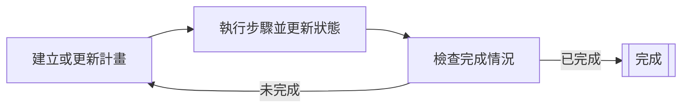

# Planner 代理

Planner 代理是透過反覆運算規劃週期來規劃並執行多步驟任務的 AI 代理。
它們會持續建立或更新計畫、執行步驟，並根據當前狀態檢查完成標準。

Planner 代理適用於複雜任務，
這些任務需要將高階目標分解為較小且可執行的步驟，
並根據每個步驟的結果調整計畫。

在使用 [以圖形為基礎的代理](../graph-based-agents.md) 時，你需要定義所有的節點與邊；
而對於 Planner 代理，你只需定義具有型別輸入與輸出的操作（節點）。
Planner 會建立適合達成目標狀態的合理邊，
並且還能更新步驟之間的最佳路徑。
這允許使用更動態的方法，與以圖形為基礎的代理相比，
這種方法功能可能更強大，但可控性較低。

Planner 代理透過反覆運算規劃週期運作：

1. Planner 根據當前狀態建立或更新計畫。
2. Planner 執行計畫中的單一步驟，並更新狀態。
3. Planner 根據當前狀態確定計畫是否已完成。
    - 如果計畫已完成，週期結束。
    - 如果計畫未完成，則從第一步開始重複週期。

Koog 提供兩種類型的 Planner 代理：

- [以 LLM 為基礎的 Planner](llm-based-planners.md) 使用 LLM 來建立和更新計畫
- [GOAP 代理](goap-agents.md) 使用特殊演算法來確定最佳操作序列