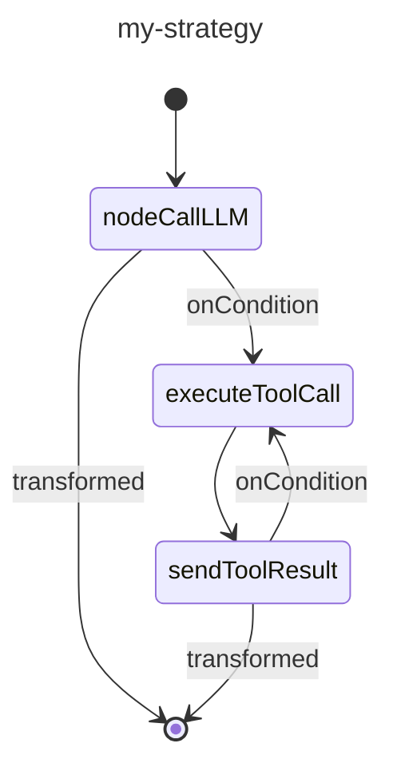

# 自訂策略圖

策略圖（Strategy graphs）是 Koog 架構中代理人（agent）工作流程的核心。它們定義了代理人如何處理輸入、與工具互動以及產生輸出。策略圖由透過邊（edges）連接的節點（nodes）組成，並由條件（conditions）決定執行流向。

建立策略圖可讓您根據特定需求調整代理人的行為，無論您是要建置簡單的聊天機器人、複雜的資料處理管線，還是介於兩者之間的任何應用。

## 策略圖架構

從高層級來看，策略圖由以下組件組成：

- **策略 (Strategy)**：圖的最上層容器，使用 `strategy` 函式建立，並使用泛型參數指定輸入與輸出型別。
- **子圖 (Subgraphs)**：圖的各個部分，可以擁有自己的一組工具和內容。
- **節點 (Nodes)**：工作流程中的個別操作或轉換。
- **邊 (Edges)**：節點之間的連接，定義了轉換條件和轉換方式。

策略圖始於名為 `nodeStart` 的特殊節點，並終於 `nodeFinish`。
這些節點之間的路徑由圖中指定的邊和條件決定。

## 策略圖組件

### 節點

節點是策略圖的建置基礎。每個節點代表一個特定的操作。

Koog 架構提供了預定義節點，也允許您使用 `node` 函式建立自訂節點。

欲了解詳情，請參閱[預定義節點與組件](nodes-and-components.md)以及[自訂節點](custom-nodes.md)。

### 邊

邊連接節點並定義策略圖中的操作流程。
邊是使用 `edge` 函式和 `forwardTo` 中綴函式建立的：

=== "Kotlin"

    <!--- INCLUDE
    import ai.koog.agents.core.dsl.builder.forwardTo
    import ai.koog.agents.core.dsl.builder.strategy
    import ai.koog.agents.core.dsl.builder.node
    import ai.koog.agents.core.dsl.builder.parallel
    import ai.koog.agents.core.dsl.builder.subgraph
    val strategy = strategy<String, String>("strategy_name") {
            val sourceNode by node<String, String> { input -> input }
            val targetNode by node<String, String> { input -> input }
    -->
    <!--- SUFFIX
    }
    -->
    ```kotlin
    edge(sourceNode forwardTo targetNode)
    ```
    <!--- KNIT example-custom-strategy-graphs-01.kt -->

=== "Java"

    <!--- INCLUDE
    import ai.koog.agents.core.agent.entity.AIAgentGraphStrategy;
    import ai.koog.agents.core.agent.entity.AIAgentNode;
    class exampleCustomStrategyGraphsJava01 {
        public static void main(String[] args) {
            var strategy = AIAgentGraphStrategy.builder("strategyName")
                .withInput(String.class)
                .withOutput(String.class);
            var sourceNode = AIAgentNode.doNothing(String.class);
            var targetNode = AIAgentNode.doNothing(String.class);
    -->
    <!--- SUFFIX
        }
    }
    -->
    ```java
    strategy.edge(sourceNode, targetNode);
    ```
    <!--- KNIT exampleCustomStrategyGraphsJava01.java -->

#### 條件

條件決定何時遵循策略圖中的特定邊。這裡有幾種常見的條件類型：

| 條件類型 | 描述 |
|---------------------|------------------------------------------------------------------------------------------|
| onCondition         | 一種通用條件，接受一個回傳布林值的 Lambda 運算式。 |
| onToolCall          | 當 LLM 呼叫工具時符合的條件。 |
| onAssistantMessage  | 當 LLM 回覆訊息時符合的條件。 |
| onMultipleToolCalls | 當 LLM 呼叫多個工具時符合的條件。 |
| onToolNotCalled     | 當 LLM 未呼叫工具時符合的條件。 |

您可以在將輸出傳遞給目標節點之前，使用 `transformed` 函式進行轉換：

=== "Kotlin"

    <!--- INCLUDE
    import ai.koog.agents.core.dsl.builder.forwardTo
    import ai.koog.agents.core.dsl.builder.strategy
    import ai.koog.agents.core.dsl.builder.node
    import ai.koog.agents.core.dsl.builder.parallel
    import ai.koog.agents.core.dsl.builder.subgraph
    val strategy = strategy<String, String>("strategy_name") {
            val sourceNode by node<String, String> { input -> input }
            val targetNode by node<String, String> { input -> input }
    -->
    <!--- SUFFIX
    }
    -->
    ```kotlin
    edge(sourceNode forwardTo targetNode 
            onCondition { input -> input.length > 10 }
            transformed { input -> input.uppercase() }
    )
    ```
    <!--- KNIT example-custom-strategy-graphs-02.kt -->

=== "Java"

    <!--- INCLUDE
    import ai.koog.agents.core.agent.entity.AIAgentEdge;
    import ai.koog.agents.core.agent.entity.AIAgentGraphStrategy;
    import ai.koog.agents.core.agent.entity.AIAgentNode;
    class exampleCustomStrategyGraphsJava02 {
        public static void main(String[] args) {
            var strategy = AIAgentGraphStrategy.builder("strategyName")
                .withInput(String.class)
                .withOutput(String.class);
            var sourceNode = AIAgentNode.doNothing(String.class);
            var targetNode = AIAgentNode.doNothing(String.class);
    -->
    <!--- SUFFIX
        }
    }
    -->
    ```java
    strategy.edge(AIAgentEdge.builder()
        .from(sourceNode)
        .to(targetNode)
        .onCondition(input -> input.length() > 10)
        .transformed(input -> input.toUpperCase())
        .build());
    ```
    <!--- KNIT exampleCustomStrategyGraphsJava02.java -->

### 子圖

子圖是策略圖中的各個部分，使用自己的一組工具和內容進行操作。
策略圖可以包含多個子圖。每個子圖都使用 `subgraph` 函式定義：

=== "Kotlin"

    <!--- INCLUDE
    import ai.koog.agents.core.dsl.builder.strategy
    import ai.koog.agents.core.dsl.builder.node
    import ai.koog.agents.core.dsl.builder.parallel
    import ai.koog.agents.core.dsl.builder.subgraph
    typealias Input = String
    typealias Output = Int
    typealias FirstInput = String
    typealias FirstOutput = Int
    typealias SecondInput = String
    typealias SecondOutput = Int
    -->
    ```kotlin
    val strategy = strategy<Input, Output>("strategy-name") {
        val firstSubgraph by subgraph<FirstInput, FirstOutput>("first") {
            // 為此子圖定義節點與邊
        }
        val secondSubgraph by subgraph<SecondInput, SecondOutput>("second") {
            // 為此子圖定義節點與邊
        }
    }
    ```
    <!--- KNIT example-custom-strategy-graphs-03.kt -->

=== "Java"

    <!--- INCLUDE
    import ai.koog.agents.core.agent.entity.AIAgentSubgraph;
    class exampleCustomStrategyGraphsJava03 {
        class FirstInput {}
        class FirstOutput {}
        class SecondInput {}
        class SecondOutput {}
        public static void main(String[] args) {
    -->
    <!--- SUFFIX
        }
    }
    -->
    ```java
    var firstSubgraph = AIAgentSubgraph.builder("first")
        .withInput(FirstInput.class)
        .withOutput(FirstOutput.class)
        .define(subgraph -> {
            // 為此子圖定義節點與邊
        })
        .build();

    var secondSubgraph = AIAgentSubgraph.builder("second")
        .withInput(SecondInput.class)
        .withOutput(SecondOutput.class)
        .define(subgraph -> {
            // 為此子圖定義節點與邊
        })
        .build();
    ```
    <!--- KNIT exampleCustomStrategyGraphsJava03.java -->

子圖可以使用工具註冊表中的任何工具。
然而，您可以指定該註冊表中可在子圖中使用的工具子集，並將其作為參數傳遞給 `subgraph` 函式：

=== "Kotlin"

    <!--- INCLUDE
    import ai.koog.agents.core.dsl.builder.strategy
    import ai.koog.agents.core.dsl.builder.node
    import ai.koog.agents.core.dsl.builder.parallel
    import ai.koog.agents.core.dsl.builder.subgraph
    import ai.koog.agents.ext.tool.SayToUser
    typealias Input = String
    typealias Output = Int
    typealias FirstInput = String
    typealias FirstOutput = Int
    val someTool = SayToUser
    -->
    ```kotlin
    val strategy = strategy<Input, Output>("strategy-name") {
        val firstSubgraph by subgraph<FirstInput, FirstOutput>(
            name = "first",
            tools = listOf(someTool)
        ) {
            // 為此子圖定義節點與邊
        }
       // 定義其他子圖
    }
    ```
    <!--- KNIT example-custom-strategy-graphs-04.kt -->

=== "Java"

    <!--- INCLUDE
    import ai.koog.agents.core.agent.entity.AIAgentSubgraph;
    import ai.koog.agents.core.tools.reflect.ToolSet;
    class exampleCustomStrategyGraphsJava04 {
        class FirstInput {}
        class FirstOutput {}
        static ToolSet someTools = null;
        public static void main(String[] args) {
    -->
    <!--- SUFFIX
        }
    }
    -->
    ```java
    var firstSubgraph = AIAgentSubgraph.builder("first")
        .withInput(FirstInput.class)
        .withOutput(FirstOutput.class)
        .limitedTools(someTools)
        .define(subgraph -> {
            // 為此子圖定義節點與邊
        })
        .build();
    ```
    <!--- KNIT exampleCustomStrategyGraphsJava04.java -->

## 基本策略圖建立

基本策略圖的操作方式如下： 

1. 將輸入發送至 LLM。
2. 若 LLM 回覆訊息，則結束流程。
3. 若 LLM 呼叫工具，則執行該工具。
4. 將工具結果發回給 LLM。
5. 若 LLM 回覆訊息，則結束流程。
6. 若 LLM 呼叫另一個工具，則執行該工具，並從步驟 4 開始重複流程。


以下是基本策略圖的範例：

=== "Kotlin"

    <!--- INCLUDE
    import ai.koog.agents.core.dsl.builder.forwardTo
    import ai.koog.agents.core.dsl.builder.strategy
    import ai.koog.agents.core.dsl.builder.node
    import ai.koog.agents.core.dsl.builder.parallel
    import ai.koog.agents.core.dsl.builder.subgraph
    import ai.koog.agents.core.dsl.extension.nodeExecuteTool
    import ai.koog.agents.core.dsl.extension.nodeLLMRequest
    import ai.koog.agents.core.dsl.extension.nodeLLMSendToolResult
    import ai.koog.agents.core.dsl.extension.onAssistantMessage
    import ai.koog.agents.core.dsl.extension.onToolCall
    -->
    ```kotlin
    val myStrategy = strategy<String, String>("my-strategy") {
        val nodeCallLLM by nodeLLMRequest()
        val executeToolCall by nodeExecuteTool()
        val sendToolResult by nodeLLMSendToolResult()
    
        edge(nodeStart forwardTo nodeCallLLM)
        edge(nodeCallLLM forwardTo nodeFinish onAssistantMessage { true })
        edge(nodeCallLLM forwardTo executeToolCall onToolCall { true })
        edge(executeToolCall forwardTo sendToolResult)
        edge(sendToolResult forwardTo nodeFinish onAssistantMessage { true })
        edge(sendToolResult forwardTo executeToolCall onToolCall { true })
    }
    ```
    <!--- KNIT example-custom-strategy-graphs-05.kt -->

=== "Java"

    <!--- INCLUDE
    import ai.koog.agents.core.agent.entity.AIAgentEdge;
    import ai.koog.agents.core.agent.entity.AIAgentGraphStrategy;
    import ai.koog.agents.core.agent.entity.AIAgentNode;
    import ai.koog.prompt.message.Message;
    class exampleCustomStrategyGraphsJava05 {
        public static void main(String[] args) {
    -->
    <!--- SUFFIX
        }
    }
    -->
    ```java
    var graph = AIAgentGraphStrategy.builder("single_run")
        .withInput(String.class)
        .withOutput(String.class);

    var nodeCallLLM = AIAgentNode.llmRequest(true, "sendInput");
    var nodeExecuteTool = AIAgentNode.executeTool("nodeExecuteTool");
    var nodeSendToolResult = AIAgentNode.llmSendToolResult("nodeSendToolResult");

    graph.edge(graph.nodeStart, nodeCallLLM);

    graph.edge(AIAgentEdge.builder()
        .from(nodeCallLLM)
        .to(nodeExecuteTool)
        .onIsInstance(Message.Tool.Call.class)
        .build());

    graph.edge(AIAgentEdge.builder()
        .from(nodeCallLLM)
        .to(graph.nodeFinish)
        .onIsInstance(Message.Assistant.class)
        .transformed(Message.Assistant::getContent)
        .build());

    graph.edge(nodeExecuteTool, nodeSendToolResult);

    graph.edge(AIAgentEdge.builder()
        .from(nodeSendToolResult)
        .to(graph.nodeFinish)
        .onIsInstance(Message.Assistant.class)
        .transformed(Message.Assistant::getContent)
        .build());

    graph.edge(AIAgentEdge.builder()
        .from(nodeSendToolResult)
        .to(nodeExecuteTool)
        .onIsInstance(Message.Tool.Call.class)
        .build());

    var strategy = graph.build();
    ```
    <!--- KNIT exampleCustomStrategyGraphsJava05.java -->

## 視覺化策略圖 

在 JVM 上，您可以為策略圖產生 [Mermaid 狀態圖 (Mermaid state diagram)](https://mermaid.js.org/syntax/stateDiagram.html)。

針對上一個範例中建立的圖表，您可以執行：

=== "Kotlin"

    <!--- INCLUDE
    import ai.koog.agents.core.agent.asMermaidDiagram
    import ai.koog.agents.core.dsl.builder.forwardTo
    import ai.koog.agents.core.dsl.builder.strategy
    import ai.koog.agents.core.dsl.builder.node
    import ai.koog.agents.core.dsl.builder.parallel
    import ai.koog.agents.core.dsl.builder.subgraph
    import ai.koog.agents.core.dsl.extension.nodeExecuteTool
    import ai.koog.agents.core.dsl.extension.nodeLLMRequest
    import ai.koog.agents.core.dsl.extension.nodeLLMSendToolResult
    import ai.koog.agents.core.dsl.extension.onAssistantMessage
    import ai.koog.agents.core.dsl.extension.onToolCall
    fun main() {
        val myStrategy = strategy("my-strategy") {
            val nodeCallLLM by nodeLLMRequest()
            val executeToolCall by nodeExecuteTool()
            val sendToolResult by nodeLLMSendToolResult()
            edge(nodeStart forwardTo nodeCallLLM)
            edge(nodeCallLLM forwardTo nodeFinish onAssistantMessage { true })
            edge(nodeCallLLM forwardTo executeToolCall onToolCall { true })
            edge(executeToolCall forwardTo sendToolResult)
            edge(sendToolResult forwardTo nodeFinish onAssistantMessage { true })
            edge(sendToolResult forwardTo executeToolCall onToolCall { true })
        }
    -->
    <!--- SUFFIX
    }
    -->
    
    ```kotlin
    val mermaidDiagram: String = myStrategy.asMermaidDiagram()
    
    println(mermaidDiagram)
    ```
    <!--- KNIT example-custom-strategy-graphs-06.kt -->

=== "Java"

    <!--- INCLUDE
    import ai.koog.agents.core.agent.MermaidDiagramGenerator;
    import ai.koog.agents.core.agent.entity.AIAgentGraphStrategy;
    class exampleCustomStrategyGraphsJava06 {
        public static void main(String[] args) {
            var myStrategy = AIAgentGraphStrategy.builder("single_run")
                .withInput(String.class)
                .withOutput(String.class)
                .build();
    -->
    <!--- SUFFIX
        }
    }
    -->
    ```java
    var mermaidDiagram = MermaidDiagramGenerator.INSTANCE.generate(myStrategy);
    System.out.println(mermaidDiagram);
    ```
    <!--- KNIT exampleCustomStrategyGraphsJava06.java -->

輸出將會是：

<!--- KNIT example-custom-strategy-graphs-01.txt -->

## 進階策略技巧

### 歷程記錄壓縮

對於長時間運行的對話，歷程記錄可能會變得龐大並消耗大量 Token。欲了解如何壓縮歷程記錄，請參閱[歷程記錄壓縮](history-compression.md)。

### 並行工具執行

對於需要並行執行多個工具的工作流程，可以使用 `nodeExecuteMultipleTools` 節點：

<!--- INCLUDE
import ai.koog.agents.core.dsl.builder.forwardTo
import ai.koog.agents.core.dsl.builder.strategy
import ai.koog.agents.core.dsl.builder.node
import ai.koog.agents.core.dsl.builder.parallel
import ai.koog.agents.core.dsl.builder.subgraph
import ai.koog.agents.core.dsl.extension.nodeExecuteMultipleTools
import ai.koog.agents.core.dsl.extension.nodeLLMSendMultipleToolResults
import ai.koog.prompt.message.Message

val strategy = strategy<String, String>("strategy_name") {
    val someNode by node<String, List<Message.Tool.Call>> { emptyList() }
-->
<!--- SUFFIX
}
-->
```kotlin
val executeMultipleTools by nodeExecuteMultipleTools()
val processMultipleResults by nodeLLMSendMultipleToolResults()

edge(someNode forwardTo executeMultipleTools)
edge(executeMultipleTools forwardTo processMultipleResults)
```
<!--- KNIT example-custom-strategy-graphs-07.kt -->

您也可以針對串流資料使用 `toParallelToolCallsRaw` 擴充函式：

<!--- INCLUDE
/*
-->
<!--- SUFFIX
*/
-->
```kotlin
parseMarkdownStreamToBooks(markdownStream).toParallelToolCallsRaw(BookTool::class).collect()
```
<!--- KNIT example-custom-strategy-graphs-08.kt -->

欲了解更多資訊，請參閱[工具](tools-overview.md#parallel-tool-calls)。 

### 並行節點執行 

並行節點執行可讓您同時執行多個節點，從而提高效能並實現複雜的工作流程。

要啟動並行節點執行，請使用 `parallel` 方法：

<!--- INCLUDE
import ai.koog.agents.core.dsl.builder.strategy
import ai.koog.agents.core.dsl.builder.node
import ai.koog.agents.core.dsl.builder.parallel
import ai.koog.agents.core.dsl.builder.subgraph

val strategy = strategy<String, String>("strategy_name") {
    val nodeCalcTokens by node<String, Int> { 42 }
    val nodeCalcSymbols by node<String, Int> { 42 }
    val nodeCalcWords by node<String, Int> { 42 }

-->
<!--- SUFFIX
}
-->
```kotlin
val calc by parallel<String, Int>(
    nodeCalcTokens, nodeCalcSymbols, nodeCalcWords,
) {
    selectByMax { it }
}
```
<!--- KNIT example-custom-strategy-graphs-09.kt -->

上述程式碼建立了一個名為 `calc` 的節點，它會並行執行 `nodeCalcTokens`、`nodeCalcSymbols` 和 `nodeCalcWords` 節點，並將結果作為 `AsyncParallelResult` 的執行個體回傳。

欲了解更多關於並行節點執行的資訊和詳細參考，請參閱[並行節點執行](parallel-node-execution.md)。

### 條件分支

對於需要根據某些條件採取不同路徑的複雜工作流程，您可以使用條件分支：

<!--- INCLUDE
import ai.koog.agents.core.dsl.builder.forwardTo
import ai.koog.agents.core.dsl.builder.strategy
import ai.koog.agents.core.dsl.builder.node
import ai.koog.agents.core.dsl.builder.parallel
import ai.koog.agents.core.dsl.builder.subgraph

val strategy = strategy<String, String>("strategy_name") {
    val someNode by node<String, String> { it }
-->
<!--- SUFFIX
}
-->
```kotlin
val branchA by node<String, String> { input ->
    // 分支 A 的邏輯
    "Branch A: $input"
}

val branchB by node<String, String> { input ->
    // 分支 B 的邏輯
    "Branch B: $input"
}

edge(
    (someNode forwardTo branchA)
            onCondition { input -> input.contains("A") }
)
edge(
    (someNode forwardTo branchB)
            onCondition { input -> input.contains("B") }
)
```
<!--- KNIT example-custom-strategy-graphs-10.kt -->

## 最佳實務

建立自訂策略圖時，請遵循以下最佳實務：

- 保持簡單。從簡單的圖表開始，並根據需要增加複雜度。
- 為您的節點和邊提供具描述性的名稱，使圖表更易於理解。
- 處理所有可能的路徑和邊緣情況。
- 使用各種輸入測試您的圖表，以確保其行為符合預期。
- 記錄圖表的用途和行為，以供日後參考。
- 使用預定義策略或常見模式作為起點。
- 對於長時間運行的對話，使用歷程記錄壓縮來減少 Token 使用量。
- 使用子圖來組織您的圖表並管理工具存取。

## 使用範例

### 語氣分析策略

語氣分析策略是一個很好的基於工具且包含歷程記錄壓縮的策略範例：

<!--- INCLUDE
import ai.koog.agents.core.agent.entity.AIAgentGraphStrategy
import ai.koog.agents.core.dsl.builder.forwardTo
import ai.koog.agents.core.dsl.builder.strategy
import ai.koog.agents.core.dsl.builder.node
import ai.koog.agents.core.dsl.builder.parallel
import ai.koog.agents.core.dsl.builder.subgraph
import ai.koog.agents.core.dsl.extension.nodeExecuteTool
import ai.koog.agents.core.dsl.extension.nodeLLMCompressHistory
import ai.koog.agents.core.dsl.extension.nodeLLMRequest
import ai.koog.agents.core.dsl.extension.nodeLLMSendToolResult
import ai.koog.agents.core.dsl.extension.onAssistantMessage
import ai.koog.agents.core.dsl.extension.onToolCall
import ai.koog.agents.core.environment.ReceivedToolResult
import ai.koog.agents.core.tools.ToolRegistry
-->
```kotlin
fun toneStrategy(name: String, toolRegistry: ToolRegistry): AIAgentGraphStrategy<String, String> {
    return strategy(name) {
        val nodeSendInput by nodeLLMRequest()
        val nodeExecuteTool by nodeExecuteTool()
        val nodeSendToolResult by nodeLLMSendToolResult()
        val nodeCompressHistory by nodeLLMCompressHistory<ReceivedToolResult>()

        // 定義代理人的流程
        edge(nodeStart forwardTo nodeSendInput)

        // 若 LLM 回覆訊息，則結束
        edge(
            (nodeSendInput forwardTo nodeFinish)
                    onAssistantMessage { true }
        )

        // 若 LLM 呼叫工具，則執行它
        edge(
            (nodeSendInput forwardTo nodeExecuteTool)
                    onToolCall { true }
        )

        // 若歷程記錄變得太大，則進行壓縮
        edge(
            (nodeExecuteTool forwardTo nodeCompressHistory)
                    onCondition { _ -> llm.readSession { prompt.messages.size > 100 } }
        )

        edge(nodeCompressHistory forwardTo nodeSendToolResult)

        // 否則，直接發送工具結果
        edge(
            (nodeExecuteTool forwardTo nodeSendToolResult)
                    onCondition { _ -> llm.readSession { prompt.messages.size <= 100 } }
        )

        // 若 LLM 呼叫另一個工具，則執行它
        edge(
            (nodeSendToolResult forwardTo nodeExecuteTool)
                    onToolCall { true }
        )

        // 若 LLM 回覆訊息，則結束
        edge(
            (nodeSendToolResult forwardTo nodeFinish)
                    onAssistantMessage { true }
        )
    }
}
```
<!--- KNIT example-custom-strategy-graphs-11.kt -->

此策略執行以下操作：

1. 將輸入發送至 LLM。
2. 若 LLM 回覆訊息，策略會結束流程。
3. 若 LLM 呼叫工具，策略會執行該工具。
4. 若歷程記錄太大（超過 100 條訊息），策略會在發送工具結果之前對其進行壓縮。
5. 否則，策略會直接發送工具結果。
6. 若 LLM 呼叫另一個工具，策略會執行它。
7. 若 LLM 回覆訊息，策略會結束流程。

## 疑難排解

在建立自訂策略圖時，您可能會遇到一些常見問題。這裡有一些疑難排解提示：

### 圖表無法到達結束節點

如果您的圖表未到達結束節點，請檢查以下各項：

- 從開始節點出發的所有路徑最終都導向結束節點。
- 您的條件是否過於嚴苛，導致無法遵循某些邊。
- 圖表中是否存在沒有結束條件的循環。

### 工具呼叫未執行

如果工具呼叫未執行，請檢查以下各項：

- 工具是否已在工具註冊表中正確註冊。
- 從 LLM 節點到工具執行節點的邊是否具有正確的條件 (`onToolCall { true }`)。

### 歷程記錄變得太大

如果您的歷程記錄變得太大並消耗過多 Token，請考慮以下各項：

- 新增歷程記錄壓縮節點。
- 使用條件檢查歷程記錄的大小，並在過大時進行壓縮。
- 使用更激進的壓縮策略（例如：使用較小 N 值的 `FromLastNMessages`）。

### 圖表行為不如預期

如果您的圖表採取了非預期的分支，請檢查以下各項：

- 您的條件是否定義正確。
- 條件是否按預期順序進行評估（邊是按定義順序檢查的）。
- 您是否不小心用更通用的條件覆蓋了特定條件。

### 出現效能問題

如果您的圖表出現效能問題，請考慮以下各項：

- 透過移除不必要的節點和邊來簡化圖表。
- 針對獨立操作使用並行工具執行。
- 壓縮歷程記錄。
- 使用更有效率的節點和操作。