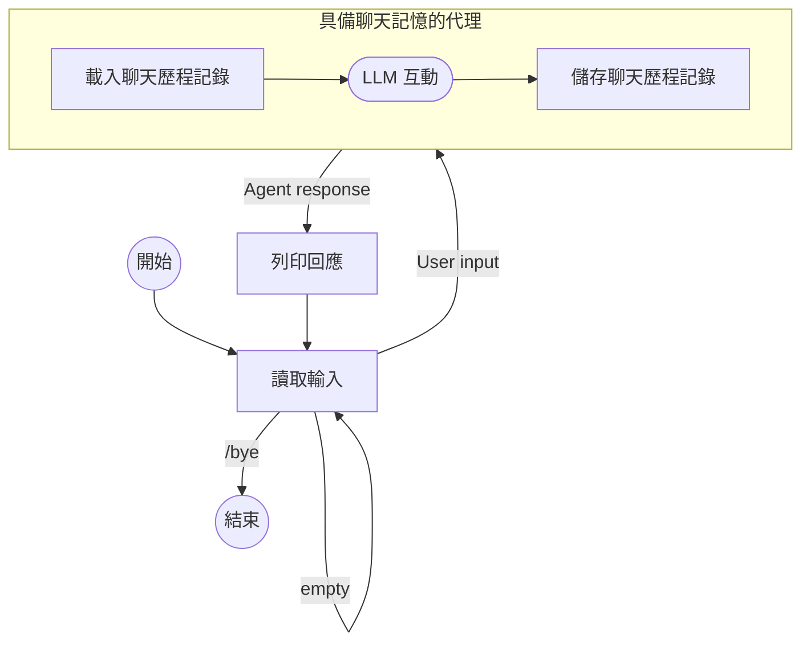

# 建立具備記憶功能的對話代理

本指南示範如何使用 [ChatMemory](index.md) 功能建立一個命令列對話應用程式，該程式可以在多次代理互動中記住先前的訊息。

此命令列應用程式執行以下迴圈：

- 從主控台讀取輸入
- 如果輸入不是 `/bye` 或為空，則使用使用者輸入和指定的工作階段 ID 執行代理
- 代理首先載入該工作階段 ID 的先前對話歷程記錄，並將訊息連同使用者輸入一起新增到提示詞中
- 代理進行 LLM 互動
- 在執行結束且回傳回應之前，代理會將完整的對話歷程記錄儲存在指定的工作階段 ID 下，並將大小限制為最近的 20 則訊息
- 應用程式隨後印出代理的回應

以下是圖解：



## 程式碼

??? note "先決條件"

    --8<-- "quickstart-snippets.md:prerequisites"

    將主 [Koog agents package](https://central.sonatype.com/artifact/ai.koog/koog-agents/) 與 [chat memory feature package](https://mvnrepository.com/artifact/ai.koog/agents-features-memory) 新增為相依性：

    === "Gradle (Kotlin)"
    
        ```kotlin title="build.gradle.kts"
        dependencies {
            implementation("ai.koog:koog-agents:1.0.0")
            implementation("ai.koog:agents-features-memory:1.0.0")
        }
        ```
    
    === "Gradle (Groovy)"
    
        ```groovy title="build.gradle"
        dependencies {
            implementation 'ai.koog:koog-agents:0.7.0'
            implementation 'ai.koog:agents-features-memory:0.7.0'
        }
        ```
    
    === "Maven"
    
        ```xml title="pom.xml"
        <dependency>
            <groupId>ai.koog</groupId>
            <artifactId>koog-agents-jvm</artifactId>
            <version>1.0.0</version>
        </dependency>
        <dependency>
            <groupId>ai.koog</groupId>
            <artifactId>agents-features-memory-jvm</artifactId>
            <version>0.7.0</version>
        </dependency>
        ```

    --8<-- "quickstart-snippets.md:api-key"

    本頁面中的範例假設您已設定 `OPENAI_API_KEY` 環境變數。

=== "Kotlin"

    <!--- INCLUDE
    import ai.koog.agents.chatMemory.feature.ChatMemory
    import ai.koog.agents.chatMemory.feature.InMemoryChatHistoryProvider
    import ai.koog.agents.core.agent.AIAgent
    import ai.koog.prompt.executor.clients.openai.OpenAIModels
    import ai.koog.prompt.executor.llms.all.simpleOpenAIExecutor
    -->
    ```kotlin
    suspend fun main() {
        val sessionId = "my-conversation"

        simpleOpenAIExecutor(System.getenv("OPENAI_API_KEY")).use { executor ->
            val agent = AIAgent(
                promptExecutor = executor,
                llmModel = OpenAIModels.Chat.GPT5_2,
                systemPrompt = "You are a helpful assistant."
            ) {
                install(ChatMemory) {
                    windowSize(20) // 僅保留最後 20 則訊息
                }
            }

            while (true) {
                print("You: ")
                val input = readln().trim()
                if (input == "/bye") break
                if (input.isEmpty()) continue

                val reply = agent.run(input, sessionId)
                println("Assistant: $reply
")
            }
        }
    }
    ```

=== "Java"

    ```java
    public class ExampleChatAgentOpenAI {
        public static void main(String[] args) {
            String sessionId = "my-conversation";
    
            try (var executor = simpleOpenAIExecutor(System.getenv("OPENAI_API_KEY"))) {
                AIAgent<String, String> agent = AIAgent.builder()
                        .promptExecutor(executor)
                        .llmModel(OpenAIModels.Chat.GPT5_2)
                        .systemPrompt("You are a helpful assistant.")
                        .install(ChatMemory.Feature, config -> {
                            config.windowSize(20); // 僅保留最後 20 則訊息
                        })
                        .build();
    
                Scanner scanner = new Scanner(System.in);
                while (true) {
                    System.out.print("You: ");
                    String input = scanner.nextLine().trim();
                    if (input.equals("/bye")) break;
                    if (input.isEmpty()) continue;
    
                    String reply = agent.run(input, sessionId);
                    System.out.println("Assistant: " + reply + "
");
                }
            } catch (Exception e) {
                e.printStackTrace();
            }
        }
    }
    ```

## 實作細節

`agent.run()` 的第二個引數是用來識別和區分進行中對話的 [工作階段 ID](index.md#session-ids)。在我們的範例中，它是固定的，因為一次只有一個對話。在實際應用程式中，您可以為與同一個使用者相關的對話設定個別唯一的 ID。

代理使用預設的 [歷程記錄提供者](index.md#history-providers)，它會將對話歷程記錄儲存在記憶體中。這意味著當應用程式結束時，歷程記錄將會遺失。在實際應用程式中，您應該實作自訂的歷程記錄提供者，以便將歷程記錄持久化儲存在資料庫或檔案中。

`windowSize(20)` [前置處理器](index.md#preprocessors) 可確保限制上下文大小：代理僅儲存最多 20 則最近的訊息。如果沒有這個設定，提示詞的大小可能會超過內容限制。

## 範例階段

```
You: My name is Alice.
Assistant: Nice to meet you, Alice! How can I help you today?

You: What's my favorite color? It's blue.
Assistant: Got it — your favorite color is blue!

You: What's my name?
Assistant: Your name is Alice!
```

即使每次互動都是獨立的代理執行，代理仍能正確回答「Your name is Alice!」，這是因為 `ChatMemory` 功能在處理第三條訊息之前，已經載入了先前的交流內容。