# 預定義節點與組件

節點是 Koog 架構中代理工作流程的基礎建構單元。
每個節點代表工作流程中的特定操作或轉換，它們可以使用邊（edge）連接來定義執行流程。

一般而言，節點讓您能將複雜邏輯封裝到可重用的組件（components）中，並可輕鬆整合到不同的代理工作流程中。本指南將引導您了解可在代理策略中使用的現有節點。

每個節點本質上是一個函式（Kotlin）或操作（Java），接受特定型別的輸入並傳回特定型別的輸出。

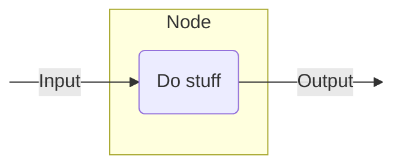
<!--- KNIT example-nodes-and-component-01.txt -->

以下是如何定義一個預期輸入為字串並傳回字串長度（整數）作為輸出的節點：

=== "Kotlin"
    <!--- INCLUDE
    import ai.koog.agents.core.dsl.builder.strategy
    import ai.koog.agents.core.dsl.builder.node
    val strategy = strategy<String, String>("strategy_name") {
    -->
    <!--- SUFFIX
    }
    -->
    ```kotlin
    val nodeLength by node<String, Int> { input ->
        input.length
    }
    ```
    <!--- KNIT example-nodes-and-component-01.kt -->

=== "Java"

    <!--- INCLUDE
    import ai.koog.agents.core.agent.entity.AIAgentGraphStrategy;
    import ai.koog.agents.core.agent.entity.AIAgentNode;
    class exampleNodesAndComponentsJava01 {
        public static void main(String[] args) {
    -->
    <!--- SUFFIX
        }
    }
    -->
    ```java
    var nodeLength = AIAgentNode.builder("nodeLength")
        .withInput(String.class)
        .withOutput(Integer.class)
        .withAction((input, ctx) -> input.length())
        .build();
    ```
    <!--- KNIT exampleNodesAndComponentsJava01.java -->

如需更多資訊，請參閱 Kotlin 的 [`node()`](api:agents-core::ai.koog.agents.core.dsl.builder.node) 或 Java 的 [`AIAgentNode.builder()`](api:agents-core::ai.koog.agents.core.agent.entity.AIAgentNode.Companion.builder)。

## 實用工具節點

### 傳遞節點

一個簡單的傳遞節點，不執行任何操作並將輸入作為輸出傳回。如需詳細資訊，請參閱 Kotlin 的 [nodeDoNothing](api:agents-core::ai.koog.agents.core.dsl.extension.nodeDoNothing) 或 Java 的 [AIAgentNode.doNothing()](api:agents-core::ai.koog.agents.core.agent.entity.AIAgentNode.Companion.doNothing)。

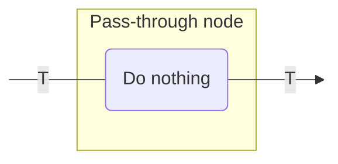
<!--- KNIT example-nodes-and-component-02.txt -->

您可以將此節點用於以下目的：

- 在圖中建立一個占位符節點。
- 在不修改資料的情況下建立連接點。

範例如下：

=== "Kotlin"

    <!--- INCLUDE
    import ai.koog.agents.core.dsl.builder.forwardTo
    import ai.koog.agents.core.dsl.builder.strategy
    import ai.koog.agents.core.dsl.builder.node
    import ai.koog.agents.core.dsl.extension.nodeDoNothing
    val strategy = strategy<String, String>("strategy_name") {
    -->
    <!--- SUFFIX
    }
    -->
    ```kotlin
    val passthrough by nodeDoNothing<String>("passthrough")

    edge(nodeStart forwardTo passthrough)
    edge(passthrough forwardTo nodeFinish)
    ```
    <!--- KNIT example-nodes-and-component-02.kt -->

=== "Java"
    
    <!--- INCLUDE
    import ai.koog.agents.core.agent.entity.AIAgentGraphStrategy;
    import ai.koog.agents.core.agent.entity.AIAgentNode;
    class exampleNodesAndComponentsJava02 {
        public static void main(String[] args) {
            var strategy = AIAgentGraphStrategy.builder("strategy_name")
                .withInput(String.class)
                .withOutput(String.class);
    -->
    <!--- SUFFIX
        }
    }
    -->
    ```java
    var passthrough = AIAgentNode.doNothing(String.class);

    strategy.edge(strategy.nodeStart, passthrough);
    strategy.edge(passthrough, strategy.nodeFinish);
    ```
    <!--- KNIT exampleNodesAndComponentsJava02.java -->

## LLM 節點

### 提示詞準備節點

**一個使用提供的提示詞建置器將訊息新增至 LLM 提示詞的節點。這對於在進行實際 LLM 請求之前修改對話上下文非常有用。** 如需詳細資訊，請參閱 Kotlin 的 [nodeAppendPrompt](api:agents-core::ai.koog.agents.core.dsl.extension.nodeAppendPrompt) 或 Java 的 [AIAgentNode.appendPrompt()](api:agents-core::ai.koog.agents.core.agent.entity.AIAgentNodeBuilderWithInput.appendPrompt)。

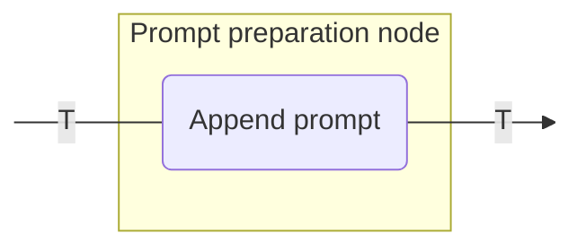
<!--- KNIT example-nodes-and-component-03.txt -->

您可以將此節點用於以下目的：

- 將系統指令新增至提示詞。
- 將使用者訊息插入對話中。
- 為後續的 LLM 請求準備上下文。

範例如下：

=== "Kotlin"

    <!--- INCLUDE
    import ai.koog.agents.core.dsl.builder.forwardTo
    import ai.koog.agents.core.dsl.builder.strategy
    import ai.koog.agents.core.dsl.builder.node
    import ai.koog.agents.core.dsl.extension.nodeAppendPrompt
    typealias Input = Unit
    typealias Output = Unit
    val strategy = strategy<String, String>("strategy_name") {
    -->
    <!--- SUFFIX
    }
    -->
    ```kotlin
    val firstNode by node<Input, Output> {
        // 將輸入轉換為輸出
    }

    val secondNode by node<Output, Output> {
        // 將輸出轉換為輸出
    }

    // 節點將從前一個節點取得 Output 型別的值作為輸入，並將其透傳至下一個節點
    val setupContext by nodeAppendPrompt<Output>("setupContext") {
        system("You are a helpful assistant specialized in Kotlin programming.")
        user("I need help with Kotlin coroutines.")
    }

    edge(firstNode forwardTo setupContext)
    edge(setupContext forwardTo secondNode)
    ```
    <!--- KNIT example-nodes-and-component-03.kt -->

=== "Java"

    <!--- INCLUDE
    import ai.koog.agents.core.agent.entity.AIAgentGraphStrategy;
    import ai.koog.agents.core.agent.entity.AIAgentNode;
    class exampleNodesAndComponentsJava03 {
        class Output {}
        class Input extends Output { }
        public static void main(String[] args) {
            var strategy = AIAgentGraphStrategy.builder("strategy_name")
                .withInput(String.class)
                .withOutput(String.class);
    -->
    <!--- SUFFIX
        }
    }
    -->
    ```java
    var firstNode = AIAgentNode.builder()
        .withInput(Input.class)
        .withOutput(Output.class)
        .withAction((input, ctx) -> {
            // 將輸入轉換為輸出
            return input;
        })
        .build();

    var secondNode = AIAgentNode.builder()
        .withInput(Output.class)
        .withOutput(Output.class)
        .withAction((output, ctx) -> {
            // 將輸出轉換為輸出
            return output;
        })
        .build();

    var setupContext = AIAgentNode.builder()
        .withInput(Output.class)
        .appendPrompt(prompt -> {
            prompt.system("You are a helpful assistant specialized in Kotlin programming.");
            prompt.user("I need help with Kotlin coroutines.");
        });

    strategy.edge(firstNode, setupContext);
    strategy.edge(setupContext, secondNode);
    ```
    <!--- KNIT exampleNodesAndComponentsJava03.java -->

### 僅限工具節點

一個將使用者訊息新增至 LLM 提示詞並取得回應的節點，其中 LLM 僅能呼叫工具。如需詳細資訊，請參閱 Kotlin 的 [nodeLLMSendMessageOnlyCallingTools](api:agents-core::ai.koog.agents.core.dsl.extension.nodeLLMSendMessageOnlyCallingTools) 或 Java 的 [AIAgentNode.llmSendMessageOnlyCallingTools()](api:agents-core::ai.koog.agents.core.agent.entity.AIAgentNode.Companion.llmSendMessageOnlyCallingTools)。

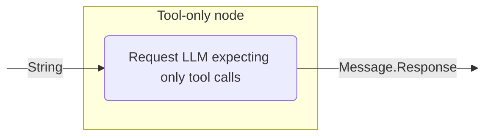
<!--- KNIT example-nodes-and-component-04.txt -->

### 強制使用單一工具節點

一個將使用者訊息新增至 LLM 提示詞並強制 LLM 使用特定工具的節點。如需詳細資訊，請參閱 Kotlin 的 [nodeLLMSendMessageForceOneTool](api:agents-core::ai.koog.agents.core.dsl.extension.nodeLLMSendMessageForceOneTool) 或 Java 的 [AIAgentNode.llmSendMessageForceOneTool()](api:agents-core::ai.koog.agents.core.agent.entity.AIAgentNode.Companion.llmSendMessageForceOneTool)。

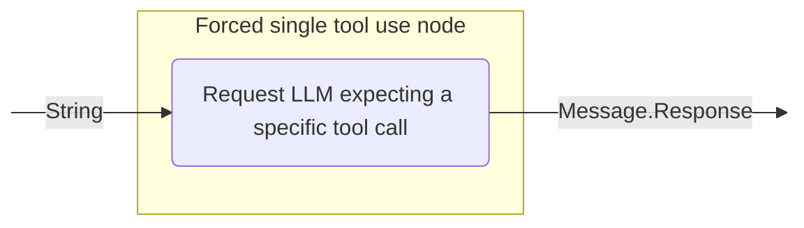
<!--- KNIT example-nodes-and-component-05.txt -->

### LLM 請求節點

一個將使用者訊息新增至 LLM 提示詞並取得回應（可選是否使用工具）的節點。節點配置決定了在處理訊息期間是否允許工具呼叫。如需詳細資訊，請參閱 Kotlin 的 [nodeLLMRequest](api:agents-core::ai.koog.agents.core.dsl.extension.nodeLLMRequest) 或 Java 的 [AIAgentNode.llmRequest()](api:agents-core::ai.koog.agents.core.agent.entity.AIAgentNode.Companion.llmRequest)。

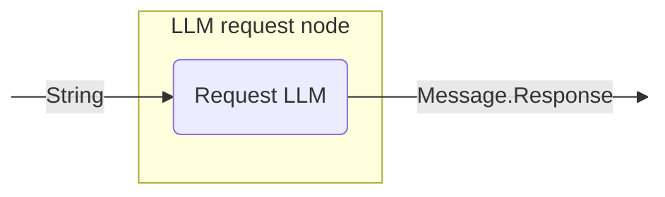
<!--- KNIT example-nodes-and-component-06.txt -->

您可以將此節點用於以下目的：

- 為目前提示詞產生 LLM 回應，並控制是否允許 LLM 產生工具呼叫。

範例如下：

=== "Kotlin"

    <!--- INCLUDE
    import ai.koog.agents.core.dsl.builder.forwardTo
    import ai.koog.agents.core.dsl.builder.strategy
    import ai.koog.agents.core.dsl.builder.node
    import ai.koog.agents.core.dsl.extension.nodeLLMRequest
    import ai.koog.agents.core.dsl.extension.nodeDoNothing
    val strategy = strategy<String, String>("strategy_name") {
        val getUserQuestion by nodeDoNothing<String>()
    -->
    <!--- SUFFIX
    }
    -->
    ```kotlin
    val requestLLM by nodeLLMRequest("requestLLM", allowToolCalls = true)
    edge(getUserQuestion forwardTo requestLLM)
    ```
    <!--- KNIT example-nodes-and-component-04.kt -->

=== "Java"

    <!--- INCLUDE
    import ai.koog.agents.core.agent.entity.AIAgentGraphStrategy;
    import ai.koog.agents.core.agent.entity.AIAgentNode;
    class exampleNodesAndComponentsJava04 {
        public static void main(String[] args) {
            var strategy = AIAgentGraphStrategy.builder("strategy_name")
                .withInput(String.class)
                .withOutput(String.class);
            var getUserQuestion = AIAgentNode.builder("getUserQuestion")
                .withInput(String.class)
                .withOutput(String.class)
                .withAction((input, ctx) -> input)
                .build();
    -->
    <!--- SUFFIX
        }
    }
    -->
    ```java
    var requestLLM = AIAgentNode.llmRequest(true, "requestLLM");

    strategy.edge(getUserQuestion, requestLLM);
    ```
    <!--- KNIT exampleNodesAndComponentsJava04.java -->

### 具結構化回應的 LLM 請求節點

一個將使用者訊息新增至 LLM 提示詞，並向 LLM 請求具有錯誤修正能力的結構化資料之節點。如需詳細資訊，請參閱 Kotlin 的 [nodeLLMRequestStructured](api:agents-core::ai.koog.agents.core.dsl.extension.nodeLLMRequestStructured) 或 Java 的 [AIAgentNode.llmRequestStructured()](api:agents-core::ai.koog.agents.core.agent.entity.AIAgentNode.Companion.llmRequestStructured)。

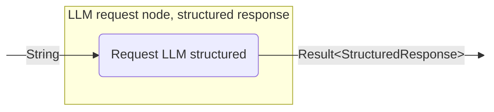
<!--- KNIT example-nodes-and-component-07.txt -->

### 具串流回應的 LLM 請求節點

一個將使用者訊息新增至 LLM 提示詞並串流 LLM 回應（可選是否進行串流資料轉換）的節點。如需詳細資訊，請參閱 Kotlin 的 [nodeLLMRequestStreaming](api:agents-core::ai.koog.agents.core.dsl.extension.nodeLLMRequestStreaming) 或 Java 的 [AIAgentNode.llmRequestStreaming()](api:agents-core::ai.koog.agents.core.agent.entity.AIAgentNode.Companion.llmRequestStreaming)。

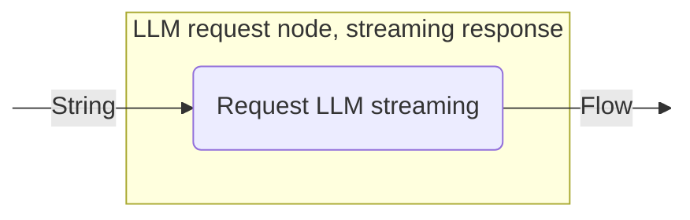
<!--- KNIT example-nodes-and-component-08.txt -->

### 具多重回應的 LLM 請求節點

一個將使用者訊息新增至 LLM 提示詞並在啟用工具呼叫的情況下取得多個 LLM 回應的節點。如需詳細資訊，請參閱 Kotlin 的 [nodeLLMRequestMultiple](api:agents-core::ai.koog.agents.core.dsl.extension.nodeLLMRequestMultiple) 或 Java 的 [AIAgentNode.llmRequestMultiple()](api:agents-core::ai.koog.agents.core.agent.entity.AIAgentNode.Companion.llmRequestMultiple)。

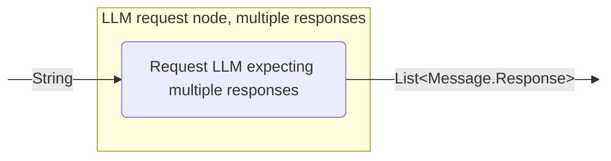
<!--- KNIT example-nodes-and-component-09.txt -->

您可以將此節點用於以下目的：

- 處理需要多個工具呼叫的複雜查詢。
- 產生多個工具呼叫。
- 實作需要多個並行操作的工作流程。

範例如下：

=== "Kotlin"

    <!--- INCLUDE
    import ai.koog.agents.core.dsl.builder.forwardTo
    import ai.koog.agents.core.dsl.builder.strategy
    import ai.koog.agents.core.dsl.builder.node
    import ai.koog.agents.core.dsl.extension.nodeLLMRequestMultiple
    import ai.koog.agents.core.dsl.extension.nodeDoNothing
    val strategy = strategy<String, String>("strategy_name") {
        val getComplexUserQuestion by nodeDoNothing<String>()
    -->
    <!--- SUFFIX
    }
    -->
    ```kotlin
    val requestLLMMultipleTools by nodeLLMRequestMultiple()
    edge(getComplexUserQuestion forwardTo requestLLMMultipleTools)
    ```
    <!--- KNIT example-nodes-and-component-05.kt -->

=== "Java"

    <!--- INCLUDE
    import ai.koog.agents.core.agent.entity.AIAgentGraphStrategy;
    import ai.koog.agents.core.agent.entity.AIAgentNode;
    class exampleNodesAndComponentsJava05 {
        public static void main(String[] args) {
            var strategy = AIAgentGraphStrategy.builder("strategy_name")
                .withInput(String.class)
                .withOutput(String.class);
            var getComplexUserQuestion = AIAgentNode.builder("getComplexUserQuestion")
                .withInput(String.class)
                .withOutput(String.class)
                .withAction((input, ctx) -> input)
                .build();
    -->
    <!--- SUFFIX
        }
    }
    -->
    ```java
    var requestLLMMultipleTools = AIAgentNode.llmRequestMultiple("requestLLMMultipleTools");

    strategy.edge(getComplexUserQuestion, requestLLMMultipleTools);
    ```
    <!--- KNIT exampleNodesAndComponentsJava05.java -->

### 歷程記錄壓縮節點

一個將目前 LLM 提示詞（訊息歷程記錄）壓縮為摘要，並以簡潔摘要（TL;DR）取代訊息的節點。這對於透過壓縮歷程記錄以減少權杖使用量來管理長對話非常有用。如需詳細資訊，請參閱 Kotlin 的 [nodeLLMCompressHistory](api:agents-core::ai.koog.agents.core.dsl.extension.nodeLLMCompressHistory) 或 Java 的 [AIAgentNode.llmCompressHistory()](api:agents-core::ai.koog.agents.core.agent.entity.AIAgentNode.Companion.llmCompressHistory)。

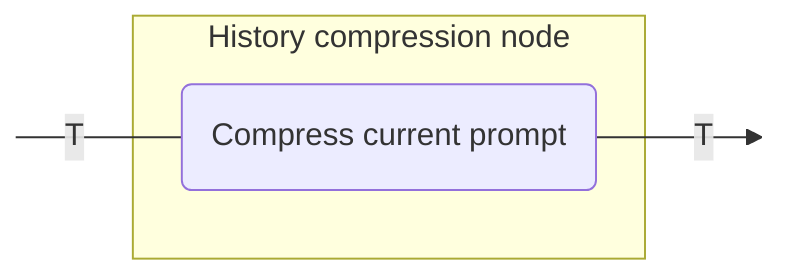
<!--- KNIT example-nodes-and-component-10.txt -->

若要進一步了解歷程記錄壓縮，請參閱 [歷程記錄壓縮](history-compression.md)。

您可以將此節點用於以下目的：

- 管理長對話以減少權杖使用量。
- 總結對話歷程記錄以維持上下文。
- 在長期執行的代理中實作記憶體管理。

範例如下：

=== "Kotlin"

    <!--- INCLUDE
    import ai.koog.agents.core.dsl.builder.forwardTo
    import ai.koog.agents.core.dsl.builder.strategy
    import ai.koog.agents.core.dsl.builder.node
    import ai.koog.agents.core.dsl.extension.nodeLLMCompressHistory
    import ai.koog.agents.core.dsl.extension.nodeDoNothing
    import ai.koog.agents.core.dsl.extension.HistoryCompressionStrategy
    val strategy = strategy<String, String>("strategy_name") {
        val generateHugeHistory by nodeDoNothing<String>()
    -->
    <!--- SUFFIX
    }
    -->
    ```kotlin
    val compressHistory by nodeLLMCompressHistory<String>(
        "compressHistory",
        strategy = HistoryCompressionStrategy.FromLastNMessages(10),
        preserveMemory = true
    )
    edge(generateHugeHistory forwardTo compressHistory)
    ```
    <!--- KNIT example-nodes-and-component-06.kt -->

=== "Java"
    
    <!--- INCLUDE
    import ai.koog.agents.core.agent.entity.AIAgentGraphStrategy;
    import ai.koog.agents.core.agent.entity.AIAgentNode;
    class exampleNodesAndComponentsJava06 {
        public static void main(String[] args) {
            var strategy = AIAgentGraphStrategy.builder("strategy_name")
                .withInput(String.class)
                .withOutput(String.class);
            var generateHugeHistory = AIAgentNode.builder("generateHugeHistory")
                .withInput(String.class)
                .withOutput(String.class)
                .withAction((input, ctx) -> input)
                .build();
    -->
    <!--- SUFFIX
        }
    }
    -->
    ```java
    var compressHistory = AIAgentNode.llmCompressHistory("compressHistory")
        .withInput(String.class)
        .build();

    strategy.edge(generateHugeHistory, compressHistory);
    ```
    <!--- KNIT exampleNodesAndComponentsJava06.java -->

## 工具節點

### 工具執行節點

一個執行單個工具呼叫並傳回其結果的節點。此節點用於處理由 LLM 發起的工具呼叫。如需詳細資訊，請參閱 Kotlin 的 [nodeExecuteTool](api:agents-core::ai.koog.agents.core.dsl.extension.nodeExecuteTool) 或 Java 的 [AIAgentNode.executeTool()](api:agents-core::ai.koog.agents.core.agent.entity.AIAgentNode.Companion.executeTool)。

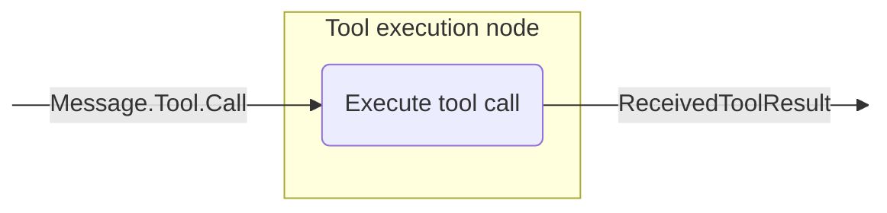
<!--- KNIT example-nodes-and-component-11.txt -->

您可以將此節點用於以下目的：

- 執行由 LLM 請求的工具。
- 處理回應 LLM 決策的特定操作。
- 將外部功能整合到代理工作流程中。

範例如下：

=== "Kotlin"

    <!--- INCLUDE
    import ai.koog.agents.core.dsl.builder.forwardTo
    import ai.koog.agents.core.dsl.builder.strategy
    import ai.koog.agents.core.dsl.builder.node
    import ai.koog.agents.core.dsl.extension.nodeExecuteTool
    import ai.koog.agents.core.dsl.extension.nodeLLMRequest
    import ai.koog.agents.core.dsl.extension.onToolCall
    val strategy = strategy<String, String>("strategy_name") {
    -->
    <!--- SUFFIX
    }
    -->
    ```kotlin
    val requestLLM by nodeLLMRequest()
    val executeTool by nodeExecuteTool()
    edge(requestLLM forwardTo executeTool onToolCall { true })
    ```
    <!--- KNIT example-nodes-and-component-07.kt -->

=== "Java"

    <!--- INCLUDE
    import ai.koog.agents.core.agent.entity.AIAgentGraphStrategy;
    import ai.koog.agents.core.agent.entity.AIAgentNode;
    import ai.koog.agents.core.agent.entity.AIAgentEdge;
    import ai.koog.prompt.message.Message;
    class exampleNodesAndComponentsJava07 {
        public static void main(String[] args) {
            var strategy = AIAgentGraphStrategy.builder("strategy_name")
                .withInput(String.class)
                .withOutput(String.class);
    -->
    <!--- SUFFIX
        }
    }
    -->
    ```java
    var requestLLM = AIAgentNode.llmRequest(true, "requestLLM");
    var executeTool = AIAgentNode.executeTool("executeTool");

    strategy.edge(AIAgentEdge.builder()
        .from(requestLLM)
        .to(executeTool)
        .onIsInstance(Message.Tool.Call.class)
        .build());
    ```
    <!--- KNIT exampleNodesAndComponentsJava07.java -->

### 工具結果追隨節點

一個將工具結果新增至提示詞並請求 LLM 回應的節點。如需詳細資訊，請參閱 Kotlin 的 [nodeLLMSendToolResult](api:agents-core::ai.koog.agents.core.dsl.extension.nodeLLMSendToolResult) 或 Java 的 [AIAgentNode.llmSendToolResult()](api:agents-core::ai.koog.agents.core.agent.entity.AIAgentNode.Companion.llmSendToolResult)。

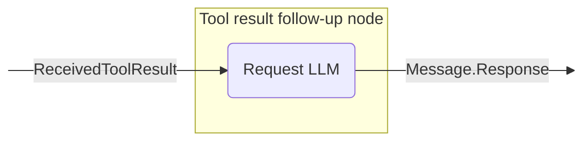
<!--- KNIT example-nodes-and-component-12.txt -->

您可以將此節點用於以下目的：

- 處理工具執行的結果。
- 根據工具輸出產生回應。
- 在工具執行後繼續對話。

範例如下：

=== "Kotlin"

    <!--- INCLUDE
    import ai.koog.agents.core.dsl.builder.forwardTo
    import ai.koog.agents.core.dsl.builder.strategy
    import ai.koog.agents.core.dsl.builder.node
    import ai.koog.agents.core.dsl.extension.nodeExecuteTool
    import ai.koog.agents.core.dsl.extension.nodeLLMSendToolResult
    val strategy = strategy<String, String>("strategy_name") {
    -->
    <!--- SUFFIX
    }
    -->
    ```kotlin
    val executeTool by nodeExecuteTool()
    val sendToolResultToLLM by nodeLLMSendToolResult()
    edge(executeTool forwardTo sendToolResultToLLM)
    ```
    <!--- KNIT example-nodes-and-component-08.kt -->

=== "Java"
    
    <!--- INCLUDE
    import ai.koog.agents.core.agent.entity.AIAgentGraphStrategy;
    import ai.koog.agents.core.agent.entity.AIAgentNode;
    class exampleNodesAndComponentsJava08 {
        public static void main(String[] args) {
            var strategy = AIAgentGraphStrategy.builder("strategy_name")
                .withInput(String.class)
                .withOutput(String.class);
    -->
    <!--- SUFFIX
        }
    }
    -->
    ```java
    var executeTool = AIAgentNode.executeTool("executeTool");
    var sendToolResultToLLM = AIAgentNode.llmSendToolResult("sendToolResultToLLM");

    strategy.edge(executeTool, sendToolResultToLLM);
    ```
    <!--- KNIT exampleNodesAndComponentsJava08.java -->

### 多工具執行節點

一個執行多個工具呼叫的節點。這些呼叫可以選擇性地並行執行。如需詳細資訊，請參閱 Kotlin 的 [nodeExecuteMultipleTools](api:agents-core::ai.koog.agents.core.dsl.extension.nodeExecuteMultipleTools) 或 Java 的 [AIAgentNode.executeMultipleTools()](api:agents-core::ai.koog.agents.core.agent.entity.AIAgentNode.Companion.executeMultipleTools)。

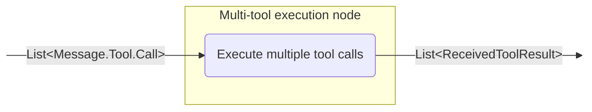
<!--- KNIT example-nodes-and-component-13.txt -->

您可以將此節點用於以下目的：

- 並行執行多個工具。
- 處理需要多次工具執行的複雜工作流程。
- 透過批次處理工具呼叫來優化效能。

範例如下：

=== "Kotlin"

    <!--- INCLUDE
    import ai.koog.agents.core.dsl.builder.forwardTo
    import ai.koog.agents.core.dsl.builder.strategy
    import ai.koog.agents.core.dsl.builder.node
    import ai.koog.agents.core.dsl.extension.nodeLLMRequestMultiple
    import ai.koog.agents.core.dsl.extension.nodeExecuteMultipleTools
    import ai.koog.agents.core.dsl.extension.onMultipleToolCalls
    val strategy = strategy<String, String>("strategy_name") {
    -->
    <!--- SUFFIX
    }
    -->
    ```kotlin
    val requestLLMMultipleTools by nodeLLMRequestMultiple()
    val executeMultipleTools by nodeExecuteMultipleTools()
    edge(requestLLMMultipleTools forwardTo executeMultipleTools onMultipleToolCalls { true })
    ```
    <!--- KNIT example-nodes-and-component-09.kt -->

=== "Java"

    <!--- INCLUDE
    import ai.koog.agents.core.agent.entity.AIAgentGraphStrategy;
    import ai.koog.agents.core.agent.entity.AIAgentNode;
    import ai.koog.agents.core.agent.entity.AIAgentEdge;
    import ai.koog.prompt.message.Message;
    class exampleNodesAndComponentsJava09 {
        public static void main(String[] args) {
            var strategy = AIAgentGraphStrategy.builder("strategy_name")
                .withInput(String.class)
                .withOutput(String.class);
    -->
    <!--- SUFFIX
        }
    }
    -->
    ```java
    var requestLLMMultipleTools = AIAgentNode.llmRequestMultiple("requestLLMMultipleTools");
    var executeMultipleTools = AIAgentNode.executeMultipleTools(false, "executeMultipleTools");

    // 從回應清單中提取工具呼叫
    strategy.edge(AIAgentEdge.builder()
        .from(requestLLMMultipleTools)
        .to(executeMultipleTools)
        .onCondition(responses -> responses.stream()
            .anyMatch(msg -> msg instanceof Message.Tool.Call))
        .transformed(responses -> responses.stream()
            .filter(msg -> msg instanceof Message.Tool.Call)
            .map(msg -> (Message.Tool.Call) msg)
            .toList())
        .build());
    ```
    <!--- KNIT exampleNodesAndComponentsJava09.java -->

### 多工具結果追隨節點

一個將多個工具結果新增至提示詞並取得多個 LLM 回應的節點。如需詳細資訊，請參閱 Kotlin 的 [nodeLLMSendMultipleToolResults](api:agents-core::ai.koog.agents.core.dsl.extension.nodeLLMSendMultipleToolResults) 或 Java 的 [AIAgentNode.llmSendMultipleToolResults()](api:agents-core::ai.koog.agents.core.agent.entity.AIAgentNode.Companion.llmSendMultipleToolResults)。

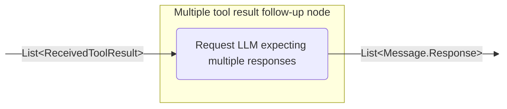
<!--- KNIT example-nodes-and-component-14.txt -->

您可以將此節點用於以下目的：

- 處理多次工具執行的結果。
- 產生多個工具呼叫。
- 實作具有多個並行操作的複雜工作流程。

範例如下：

=== "Kotlin"

    <!--- INCLUDE
    import ai.koog.agents.core.dsl.builder.forwardTo
    import ai.koog.agents.core.dsl.builder.strategy
    import ai.koog.agents.core.dsl.builder.node
    import ai.koog.agents.core.dsl.extension.nodeLLMSendMultipleToolResults
    import ai.koog.agents.core.dsl.extension.nodeExecuteMultipleTools
    val strategy = strategy<String, String>("strategy_name") {
    -->
    <!--- SUFFIX
    }
    -->
    ```kotlin
    val executeMultipleTools by nodeExecuteMultipleTools()
    val sendMultipleToolResultsToLLM by nodeLLMSendMultipleToolResults()
    edge(executeMultipleTools forwardTo sendMultipleToolResultsToLLM)
    ```
    <!--- KNIT example-nodes-and-component-10.kt -->

=== "Java"
    
    <!--- INCLUDE
    import ai.koog.agents.core.agent.entity.AIAgentGraphStrategy;
    import ai.koog.agents.core.agent.entity.AIAgentNode;
    import ai.koog.prompt.message.Message;
    class exampleNodesAndComponentsJava10 {
        public static void main(String[] args) {
            var strategy = AIAgentGraphStrategy.builder("strategy_name")
                .withInput(String.class)
                .withOutput(String.class);
    -->
    <!--- SUFFIX
        }
    }
    -->
    ```java
    var executeMultipleTools = AIAgentNode.executeMultipleTools(false, "executeMultipleTools");
    var sendMultipleToolResultsToLLM = AIAgentNode.llmSendMultipleToolResults("sendMultipleToolResultsToLLM");

    strategy.edge(executeMultipleTools, sendMultipleToolResultsToLLM);
    ```
    <!--- KNIT exampleNodesAndComponentsJava10.java -->

## 節點輸出轉換

該架構在 Kotlin 中提供了 `transform` 擴充函式，讓您可以建立節點的轉換版本，對其輸出套用轉換。在 Java 中，您可以透過建立具有明確轉換的過渡節點來達到相同的結果。當您需要將節點的輸出轉換為不同的型別或格式，同時保留原始節點的功能時，這非常有用。

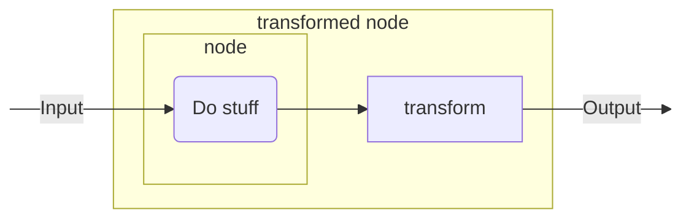
<!--- KNIT example-nodes-and-component-15.txt -->

### 節點轉換

在 Kotlin 中，[`transform()`](api:agents-core::ai.koog.agents.core.dsl.builder.AIAgentNodeDelegate.transform) 函式會建立一個新的 `AIAgentNodeDelegate`，它封裝了原始節點並對其輸出套用轉換函式。在 Java 中，您需要使用 `AIAgentNode.builder()` 與明確的型別參數，手動組合包含轉換邏輯的節點。

=== "Kotlin"

    <!--- INCLUDE
    /**
    -->
    <!--- SUFFIX
    **/
    -->
    ```kotlin
    inline fun <reified T> AIAgentNodeDelegate<Input, Output>.transform(
        noinline transformation: suspend (Output) -> T
    ): AIAgentNodeDelegate<Input, T>
    ```
    <!--- KNIT example-nodes-and-component-11.kt -->

=== "Java"

    ```java
    // 在 Java 中，您需要使用 AIAgentNode.builder() 與明確的型別參數，
    // 手動組合包含轉換邏輯的節點。
    // 請參閱下方的 Java 節點轉換方法範例。
    ```
    <!--- KNIT example-nodes-and-component-java-01.java -->

#### 自訂節點轉換

將自訂節點的輸出轉換為不同的資料型別：

=== "Kotlin"

    <!--- INCLUDE
    import ai.koog.agents.core.dsl.builder.forwardTo
    import ai.koog.agents.core.dsl.builder.strategy
    import ai.koog.agents.core.dsl.builder.node
    import ai.koog.agents.core.dsl.extension.nodeDoNothing
    val strategy = strategy<String, Int>("strategy_name") {
    -->
    <!--- SUFFIX
    }
    -->
    ```kotlin
    val textNode by nodeDoNothing<String>("textNode").transform<Int> { text ->
        text.split(" ").filter { it.isNotBlank() }.size
    }

    edge(nodeStart forwardTo textNode)
    edge(textNode forwardTo nodeFinish)
    ```
    <!--- KNIT example-nodes-and-component-12.kt -->

=== "Java"
    
    <!--- INCLUDE
    import ai.koog.agents.core.agent.entity.AIAgentGraphStrategy;
    import ai.koog.agents.core.agent.entity.AIAgentNode;
    class exampleNodesAndComponentsJava11 {
        public static void main(String[] args) {
            var strategy = AIAgentGraphStrategy.builder("strategy_name")
                .withInput(String.class)
                .withOutput(Integer.class);
    -->
    <!--- SUFFIX
        }
    }
    -->
    ```java
    var textNode = AIAgentNode.builder("textNode")
        .withInput(String.class)
        .withOutput(Integer.class)
        .withAction((text, ctx) -> {
            String[] words = text.split(" ");
            int count = 0;
            for (String word : words) {
                if (!word.isBlank()) {
                    count++;
                }
            }
            return count;
        })
        .build();

    strategy.edge(strategy.nodeStart, textNode);
    strategy.edge(textNode, strategy.nodeFinish);
    ```
    <!--- KNIT exampleNodesAndComponentsJava11.java -->

#### 內建節點轉換

轉換諸如 Kotlin 的 `nodeLLMRequest` 或 Java 的 `AIAgentNode.llmRequest()` 等內建節點的輸出：

=== "Kotlin"

    <!--- INCLUDE
    import ai.koog.agents.core.dsl.builder.forwardTo
    import ai.koog.agents.core.dsl.builder.strategy
    import ai.koog.agents.core.dsl.builder.node
    import ai.koog.agents.core.dsl.extension.nodeLLMRequest
    val strategy = strategy<String, Int>("strategy_name") {
    -->
    <!--- SUFFIX
    }
    -->
    ```kotlin
    val lengthNode by nodeLLMRequest("llmRequest").transform<Int> { assistantMessage ->
        assistantMessage.content.length
    }

    edge(nodeStart forwardTo lengthNode)
    edge(lengthNode forwardTo nodeFinish)
    ```
    <!--- KNIT example-nodes-and-component-13.kt -->

=== "Java"
    
    <!--- INCLUDE
    import ai.koog.agents.core.agent.entity.AIAgentGraphStrategy;
    import ai.koog.agents.core.agent.entity.AIAgentNode;
    import ai.koog.prompt.message.Message;
    class exampleNodesAndComponentsJava12 {
        public static void main(String[] args) {
            var strategy = AIAgentGraphStrategy.builder("strategy_name")
                .withInput(String.class)
                .withOutput(Integer.class);
    -->
    <!--- SUFFIX
        }
    }
    -->
    ```java
    var llmRequest = AIAgentNode.llmRequest(true, "llmRequest");
    var lengthNode = AIAgentNode.builder("lengthNode")
        .withInput(Message.Response.class)
        .withOutput(Integer.class)
        .withAction((assistantMessage, ctx) -> {
            if (assistantMessage instanceof Message.Assistant) {
                return ((Message.Assistant) assistantMessage).getContent().length();
            }
            return 0;
        })
        .build();

    strategy.edge(strategy.nodeStart, llmRequest);
    strategy.edge(llmRequest, lengthNode);
    strategy.edge(lengthNode, strategy.nodeFinish);
    ```
    <!--- KNIT exampleNodesAndComponentsJava12.java -->

## 預定義子圖

架構提供了預定義的子圖，封裝了常用的模式和工作流程。這些子圖透過自動處理基礎節點和邊的建立，簡化了複雜代理策略的開發。API 在 Kotlin 和 Java 之間保持一致，Kotlin 使用 DSL 函式，Java 則使用建置器方法。

透過使用預定義子圖，您可以實作各種熱門的管線。範例如下：

1. 準備資料。
2. 執行任務。
3. 驗證任務結果。如果結果不正確，則帶著回饋訊息返回第 2 步進行調整。

### 任務執行子圖

一個使用提供的工具執行特定任務並傳回結構化結果的子圖。它支援多重回應 LLM 互動（助理可能會產生多個回應，其中交錯著工具呼叫），並讓您控制工具呼叫的執行方式。在 Kotlin 中使用 [`subgraphWithTask()`](api:agents-core::ai.koog.agents.ext.agent.subgraphWithTask)，而在 Java 中使用 [`AIAgentSubgraph.builder().withTask()`](api:agents-core::ai.koog.agents.core.agent.entity.TypedAIAgentSubgraphBuilder.withTask)。

您可以將此子圖用於以下目的：

- 建立特殊組件，以處理較大工作流程中的特定任務。
- 使用清晰的輸入與輸出介面封裝複雜邏輯。
- 配置特定任務的工具、模型和提示詞。
- 透過自動壓縮管理對話歷程記錄。
- 開發結構化的代理工作流程和任務執行管線。
- 從 LLM 任務執行中產生結構化結果，包括具有多個助理回應和工具呼叫的流程。

API 允許您透過選用參數微調執行過程：

- [runMode](api:agents-core::ai.koog.agents.core.agent.entity.SubgraphWithTaskBuilder.runMode)：控制任務期間工具呼叫的執行方式（預設為循序執行）。當底層模型/執行器支援時，使用此參數在不同的工具執行策略之間切換。
- [assistantResponseRepeatMax](api:agents-core::ai.koog.agents.core.agent.entity.SubgraphWithTaskBuilder.assistantResponseRepeatMax)：限制在判定任務無法完成之前允許的助理回應次數（如果未提供，則預設為安全的內部限制）。

您可以將任務以文字形式提供給子圖，根據需要配置 LLM，並提供必要的工具，子圖將處理並解決該任務。範例如下：

=== "Kotlin"

    <!--- INCLUDE
    import ai.koog.agents.core.dsl.builder.strategy
    import ai.koog.agents.core.dsl.builder.node
    import ai.koog.agents.ext.tool.SayToUser
    import ai.koog.prompt.executor.clients.openai.OpenAIModels
    import ai.koog.agents.ext.agent.subgraphWithTask
    import ai.koog.agents.core.agent.ToolCalls
    val searchTool = SayToUser
    val calculatorTool = SayToUser
    val weatherTool = SayToUser
    val strategy = strategy<String, String>("strategy_name") {
    -->
    <!--- SUFFIX
    }
    -->
    ```kotlin
    val processQuery by subgraphWithTask<String, String>(
        tools = listOf(searchTool, calculatorTool, weatherTool),
        llmModel = OpenAIModels.Chat.GPT4o,
        runMode = ToolCalls.SEQUENTIAL,
        assistantResponseRepeatMax = 3,
    ) { userQuery ->
        """
        You are a helpful assistant that can answer questions about various topics.
        Please help with the following query:
        $userQuery
        """
    }
    ```
    <!--- KNIT example-nodes-and-component-14.kt -->

=== "Java"
    
    <!--- INCLUDE
    import ai.koog.agents.core.agent.entity.AIAgentGraphStrategy;
    import ai.koog.agents.core.agent.entity.AIAgentSubgraph;
    import ai.koog.agents.core.agent.ToolCalls;
    import ai.koog.agents.ext.tool.SayToUser;
    import java.util.List;
    class exampleNodesAndComponentsJava13 {
        public static void main(String[] args) {
            var strategy = AIAgentGraphStrategy.builder("strategy_name")
                .withInput(String.class)
                .withOutput(String.class);
            SayToUser searchTool = SayToUser.INSTANCE;
            SayToUser calculatorTool = SayToUser.INSTANCE;
            SayToUser weatherTool = SayToUser.INSTANCE;
    -->
    <!--- SUFFIX
        }
    }
    -->
    ```java
    var processQuery = AIAgentSubgraph.builder("processQuery")
        .limitedTools(List.of(searchTool, calculatorTool, weatherTool))
        .withInput(String.class)
        .withOutput(String.class)
        .withTask(userQuery ->
            "You are a helpful assistant that can answer questions about various topics.
" +
            "Please help with the following query:
" +
            userQuery)
        .runMode(ToolCalls.SEQUENTIAL)
        .assistantResponseRepeatMax(3)
        .build();
    ```
    <!--- KNIT exampleNodesAndComponentsJava13.java -->

### 具驗證功能的任務執行子圖

`subgraphWithTask` 的特殊版本，用於驗證任務是否已正確執行，並提供遇到的任何問題之詳細資訊。此子圖對於需要驗證或品質檢查的工作流程非常有用。在 Kotlin 中使用 [`subgraphWithVerification()`](api:agents-core::ai.koog.agents.ext.agent.subgraphWithVerification)，而在 Java 中使用 `AIAgentSubgraph.builder().withVerification()`。

您可以將此子圖用於以下目的：

- 驗證任務執行的正確性。
- 在工作流程中實作品質控制程序。
- 建立自我驗證組件。
- 產生包含成功/失敗狀態和詳細回饋的結構化驗證結果。

該子圖確保 LLM 在工作流程結束時呼叫驗證工具，以檢查任務是否成功完成。它保證此驗證作為最後一個步驟執行，並傳回一個 [CriticResult](api:agents-core::ai.koog.agents.ext.agent.CriticResult)，指示任務是否成功完成並提供詳細回饋。
範例如下：

=== "Kotlin"

    <!--- INCLUDE
    import ai.koog.agents.core.dsl.builder.strategy
    import ai.koog.agents.core.dsl.builder.node
    import ai.koog.agents.ext.tool.SayToUser
    import ai.koog.prompt.executor.clients.anthropic.AnthropicModels
    import ai.koog.agents.ext.agent.subgraphWithVerification
    import ai.koog.agents.core.agent.ToolCalls
    val runTestsTool = SayToUser
    val analyzeTool = SayToUser
    val readFileTool = SayToUser
    val strategy = strategy<String, String>("strategy_name") {
    -->
    <!--- SUFFIX
    }
    -->
    ```kotlin
    val verifyCode by subgraphWithVerification<String>(
        tools = listOf(runTestsTool, analyzeTool, readFileTool),
        llmModel = AnthropicModels.Opus_4_6,
        runMode = ToolCalls.SEQUENTIAL,
        assistantResponseRepeatMax = 3,
    ) { codeToVerify ->
        """
        You are a code reviewer. Please verify that the following code meets all requirements:
        1. It compiles without errors
        2. All tests pass
        3. It follows the project's coding standards

        Code to verify:
        $codeToVerify
        """
    }
    ```
    <!--- KNIT example-nodes-and-component-15.kt -->

=== "Java"

    <!--- INCLUDE
    import ai.koog.agents.core.agent.entity.AIAgentGraphStrategy;
    import ai.koog.agents.core.agent.entity.AIAgentSubgraph;
    import ai.koog.agents.core.agent.ToolCalls;
    import ai.koog.agents.ext.tool.SayToUser;
    import java.util.List;
    class exampleNodesAndComponentsJava14 {
        public static void main(String[] args) {
            var strategy = AIAgentGraphStrategy.builder("strategy_name")
                .withInput(String.class)
                .withOutput(String.class);
            SayToUser runTestsTool = SayToUser.INSTANCE;
            SayToUser analyzeTool = SayToUser.INSTANCE;
            SayToUser readFileTool = SayToUser.INSTANCE;
    -->
    <!--- SUFFIX
        }
    }
    -->
    ```java
    var verifyCode = AIAgentSubgraph.builder("verifyCode")
        .limitedTools(List.of(runTestsTool, analyzeTool, readFileTool))
        .withInput(String.class)
        .withVerification(codeToVerify ->
            "You are a code reviewer. Please verify that the following code meets all requirements:
" +
            "1. It compiles without errors
" +
            "2. All tests pass
" +
            "3. It follows the project's coding standards
\n" +
            "Code to verify:
" +
            codeToVerify)
        .runMode(ToolCalls.SEQUENTIAL)
        .assistantResponseRepeatMax(3)
        .build();
    ```
    <!--- KNIT exampleNodesAndComponentsJava14.java -->

## 預定義策略與常用策略模式

Koog 提供了結合各種節點的預定義策略。
節點使用邊連接以定義操作流程，並帶有指定何時遵循每條邊的條件。

如果需要，您可以將這些策略整合到您的代理工作流程中。

### 單次執行策略

單次執行策略專為非互動式使用案例設計，其中代理處理輸入一次並傳回結果。

當您需要執行不需要複雜邏輯的直接程序時，可以使用此策略。

=== "Kotlin"

    <!--- INCLUDE
    import ai.koog.agents.core.agent.entity.AIAgentGraphStrategy
    import ai.koog.agents.core.dsl.builder.forwardTo
    import ai.koog.agents.core.dsl.builder.strategy
    import ai.koog.agents.core.dsl.builder.node
    import ai.koog.agents.core.dsl.extension.*
    -->
    ```kotlin
    public fun singleRunStrategy(): AIAgentGraphStrategy<String, String> = strategy("single_run") {
        val nodeCallLLM by nodeLLMRequest("sendInput")
        val nodeExecuteTool by nodeExecuteTool("nodeExecuteTool")
        val nodeSendToolResult by nodeLLMSendToolResult("nodeSendToolResult")

        edge(nodeStart forwardTo nodeCallLLM)
        edge(nodeCallLLM forwardTo nodeExecuteTool onToolCall { true })
        edge(nodeCallLLM forwardTo nodeFinish onAssistantMessage { true })
        edge(nodeExecuteTool forwardTo nodeSendToolResult)
        edge(nodeSendToolResult forwardTo nodeFinish onAssistantMessage { true })
        edge(nodeSendToolResult forwardTo nodeExecuteTool onToolCall { true })
    }
    ```
    <!--- KNIT example-nodes-and-component-16.kt -->

=== "Java"
    
    <!--- INCLUDE
    import ai.koog.agents.core.agent.entity.AIAgentEdge;
    import ai.koog.agents.core.agent.entity.AIAgentGraphStrategy;
    import ai.koog.agents.core.agent.entity.AIAgentNode;
    import ai.koog.prompt.message.Message;
    class exampleNodesAndComponentsJava15 {
    -->
    <!--- SUFFIX
        public static void main(String[] args) {
        }
    }
    -->
    ```java
    public static AIAgentGraphStrategy<String, String> singleRunStrategy() {
        var strategy = AIAgentGraphStrategy.builder("single_run")
            .withInput(String.class)
            .withOutput(String.class);

        var nodeCallLLM = AIAgentNode.llmRequest(true, "sendInput");
        var nodeExecuteTool = AIAgentNode.executeTool("nodeExecuteTool");
        var nodeSendToolResult = AIAgentNode.llmSendToolResult("nodeSendToolResult");

        strategy.edge(strategy.nodeStart, nodeCallLLM);

        strategy.edge(AIAgentEdge.builder()
            .from(nodeCallLLM)
            .to(nodeExecuteTool)
            .onIsInstance(Message.Tool.Call.class)
            .build());

        strategy.edge(AIAgentEdge.builder()
            .from(nodeCallLLM)
            .to(strategy.nodeFinish)
            .onIsInstance(Message.Assistant.class)
            .transformed(Message.Assistant::getContent)
            .build());

        strategy.edge(nodeExecuteTool, nodeSendToolResult);

        strategy.edge(AIAgentEdge.builder()
            .from(nodeSendToolResult)
            .to(strategy.nodeFinish)
            .onIsInstance(Message.Assistant.class)
            .transformed(Message.Assistant::getContent)
            .build());

        strategy.edge(AIAgentEdge.builder()
            .from(nodeSendToolResult)
            .to(nodeExecuteTool)
            .onIsInstance(Message.Tool.Call.class)
            .build());

        return strategy.build();
    }
    ```
    <!--- KNIT exampleNodesAndComponentsJava15.java -->

### 基於工具的策略

基於工具的策略專為高度依賴工具執行特定操作的工作流程而設計。它通常根據 LLM 的決策執行工具並處理結果。

=== "Kotlin"

    <!--- INCLUDE
    import ai.koog.agents.core.agent.entity.AIAgentGraphStrategy
    import ai.koog.agents.core.dsl.builder.forwardTo
    import ai.koog.agents.core.dsl.builder.strategy
    import ai.koog.agents.core.dsl.builder.node
    import ai.koog.agents.core.dsl.extension.*
    import ai.koog.agents.core.tools.ToolRegistry
    -->
    ```kotlin
    fun toolBasedStrategy(name: String, toolRegistry: ToolRegistry): AIAgentGraphStrategy<String, String> {
        return strategy(name) {
            val nodeSendInput by nodeLLMRequest()
            val nodeExecuteTool by nodeExecuteTool()
            val nodeSendToolResult by nodeLLMSendToolResult()

            // 定義代理的流程
            edge(nodeStart forwardTo nodeSendInput)

            // 如果 LLM 以訊息回應，則結束
            edge(
                (nodeSendInput forwardTo nodeFinish)
                        onAssistantMessage { true }
            )

            // 如果 LLM 呼叫工具，則執行它
            edge(
                (nodeSendInput forwardTo nodeExecuteTool)
                        onToolCall { true }
            )

            // 將工具結果傳回給 LLM
            edge(nodeExecuteTool forwardTo nodeSendToolResult)

            // 如果 LLM 呼叫另一個工具，則執行它
            edge(
                (nodeSendToolResult forwardTo nodeExecuteTool)
                        onToolCall { true }
            )

            // 如果 LLM 以訊息回應，則結束
            edge(
                (nodeSendToolResult forwardTo nodeFinish)
                        onAssistantMessage { true }
            )
        }
    }
    ```
    <!--- KNIT example-nodes-and-component-17.kt -->

=== "Java"
    
    <!--- INCLUDE
    import ai.koog.agents.core.agent.entity.AIAgentEdge;
    import ai.koog.agents.core.agent.entity.AIAgentGraphStrategy;
    import ai.koog.agents.core.agent.entity.AIAgentNode;
    import ai.koog.prompt.message.Message;
    import ai.koog.agents.core.tools.ToolRegistry;
    class exampleNodesAndComponentsJava16 {
    -->
    <!--- SUFFIX
        public static void main(String[] args) {
        }
    }
    -->
    ```java
    public static AIAgentGraphStrategy<String, String> toolBasedStrategy(String name, ToolRegistry toolRegistry) {
        var strategy = AIAgentGraphStrategy.builder(name)
            .withInput(String.class)
            .withOutput(String.class);

        var nodeSendInput = AIAgentNode.llmRequest(true, "nodeSendInput");
        var nodeExecuteTool = AIAgentNode.executeTool("nodeExecuteTool");
        var nodeSendToolResult = AIAgentNode.llmSendToolResult("nodeSendToolResult");

        // 定義代理的流程
        strategy.edge(strategy.nodeStart, nodeSendInput);

        // 如果 LLM 以訊息回應，則結束
        strategy.edge(AIAgentEdge.builder()
            .from(nodeSendInput)
            .to(strategy.nodeFinish)
            .onIsInstance(Message.Assistant.class)
            .transformed(Message.Assistant::getContent)
            .build());

        // 如果 LLM 呼叫工具，則執行它
        strategy.edge(AIAgentEdge.builder()
            .from(nodeSendInput)
            .to(nodeExecuteTool)
            .onIsInstance(Message.Tool.Call.class)
            .build());

        // 將工具結果傳回給 LLM
        strategy.edge(nodeExecuteTool, nodeSendToolResult);

        // 如果 LLM 呼叫另一個工具，則執行它
        strategy.edge(AIAgentEdge.builder()
            .from(nodeSendToolResult)
            .to(nodeExecuteTool)
            .onIsInstance(Message.Tool.Call.class)
            .build());

        // 如果 LLM 以訊息回應，則結束
        strategy.edge(AIAgentEdge.builder()
            .from(nodeSendToolResult)
            .to(strategy.nodeFinish)
            .onIsInstance(Message.Assistant.class)
            .transformed(Message.Assistant::getContent)
            .build());

        return strategy.build();
    }
    ```
    <!--- KNIT exampleNodesAndComponentsJava16.java -->

### 串流資料策略

串流資料策略專為處理來自 LLM 的串流資料而設計。它通常請求串流資料，處理該資料，並可能使用處理後的資料呼叫工具。

=== "Kotlin"

    <!--- INCLUDE
    import ai.koog.agents.core.dsl.builder.forwardTo
    import ai.koog.agents.core.dsl.builder.strategy
    import ai.koog.agents.core.dsl.builder.node
    import ai.koog.agents.example.exampleStreamingApi05.Book
    import ai.koog.agents.example.exampleStreamingApi06.markdownBookDefinition
    import ai.koog.agents.example.exampleStreamingApi08.parseMarkdownStreamToBooks
    -->
    ```kotlin
    val agentStrategy = strategy<String, List<Book>>("library-assistant") {
        // 描述包含輸出串流剖析的節點
        val getMdOutput by node<String, List<Book>> { booksDescription ->
            val books = mutableListOf<Book>()
            val mdDefinition = markdownBookDefinition()

            llm.writeSession {
                appendPrompt { user(booksDescription) }
                // 以定義 `mdDefinition` 的形式啟動回應串流
                val markdownStream = requestLLMStreaming(mdDefinition)
                // 使用回應串流的結果呼叫剖析器，並對結果執行操作
                parseMarkdownStreamToBooks(markdownStream).collect { book ->
                    books.add(book)
                    println("Parsed Book: ${book.title} by ${book.author}")
                }
            }

            books
        }
        // 描述代理的圖，確保節點是可存取的
        edge(nodeStart forwardTo getMdOutput)
        edge(getMdOutput forwardTo nodeFinish)
    }
    ```
    <!--- KNIT example-nodes-and-component-18.kt -->

=== "Java"

    <!--- INCLUDE
    import ai.koog.agents.core.agent.entity.AIAgentGraphStrategy;
    import ai.koog.agents.core.agent.entity.AIAgentNode;
    import ai.koog.prompt.streaming.StreamFrame;
    import ai.koog.prompt.structure.StructureDefinition;
    import ai.koog.prompt.structure.markdown.MarkdownStructureDefinition;
    import ai.koog.serialization.TypeCapture;
    import ai.koog.serialization.TypeToken;
    import java.util.ArrayList;
    import java.util.List;
    import java.util.concurrent.Flow;
    class exampleNodesAndComponentsJava17 {
        class Book {
            String getTitle() {
                return "";
            }
            String getAuthor() {
                return "";
            }
        }
        public static MarkdownStructureDefinition markdownBookDefinition() {
            return null;
        }
        public static Flow.Publisher<Book> parseMarkdownStreamToBooks(Flow.Publisher<StreamFrame> markdownStream) {
            return null;
        }
        public static void main(String[] args) {
    -->
    <!--- SUFFIX
        }
    }
    -->
    ```java
    var strategy = AIAgentGraphStrategy.builder()
        .withInput(String.class)
        .withOutput(List.class);

    var getMdOutput = AIAgentNode.builder()
        .withInput(String.class)
        .<List<Book>>withOutput(TypeToken.of(new TypeCapture<List<Book>>() {}))
        .withAction((booksDescription, ctx) -> {
            var books = new ArrayList<Book>();
            StructureDefinition mdDefinition = markdownBookDefinition();

            ctx.getLlm().writeSession(session -> {
                session.appendPrompt(prompt -> {
                    prompt.user(booksDescription);
                });

                // 以定義 `mdDefinition` 的形式啟動回應串流
                var markdownStream = session.requestLLMStreaming(mdDefinition);
                // 使用回應串流的結果呼叫剖析器，並對結果執行操作
                parseMarkdownStreamToBooks(markdownStream).subscribe(new Flow.Subscriber<>() {
                    @Override
                    public void onSubscribe(Flow.Subscription subscription) {
                    }

                    @Override
                    public void onNext(Book book) {
                        books.add(book);
                        System.out.println("Parsed Book: " + book.getTitle() + " by " + book.getAuthor());
                    }

                    @Override
                    public void onError(Throwable throwable) {
                    }

                    @Override
                    public void onComplete() {
                    }
                });

                return null;
            });

            return books;
        })
        .build();

    strategy.edge(strategy.nodeStart, getMdOutput);
    strategy.edge(getMdOutput, strategy.nodeFinish);
    ```
    <!--- KNIT exampleNodesAndComponentsJava17.java -->