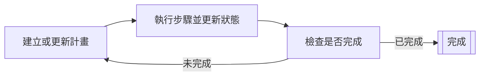

# 規劃代理 (Planner agents)

規劃代理 (Planner agents) 是透過迭代規劃週期來規劃與執行多步驟任務的 AI 代理。
它們會持續建立或更新計畫、執行步驟，並根據當前狀態檢查是否符合完成準則。

規劃代理適用於複雜任務，
這些任務需要將高階目標分解為較小的、可操作的步驟，
並根據每個步驟的結果調整計畫。

規劃代理透過迭代規劃週期運作：

1. 規劃器根據當前狀態建立或更新計畫。
2. 規劃器從計畫中執行單一步驟，並更新狀態。
3. 規劃器根據當前狀態判斷計畫是否已完成。
    - 如果計畫已完成，則週期結束。
    - 如果計畫未完成，則從第一個步驟開始重複週期。



## 前置需求

在開始之前，請確保你具備以下條件：

- 一個運作中的 Kotlin/JVM 專案。
- 已安裝 Java 17+。
- 來自 LLM 提供商的有效 API 金鑰，用於實作 AI 代理。如需所有可用提供商的清單，
請參閱 [LLM 提供商](llm-providers.md)。

!!! tip
    使用環境變數或安全的組態管理系統來儲存你的 API 金鑰。
    避免將 API 金鑰直接寫死 (hardcoding) 在原始碼中。

## 新增相依性

要使用規劃代理，請在你的組建組態中包含以下相依性：

```
dependencies {
    implementation("ai.koog:koog-agents:VERSION")
}
```

如需所有可用的安裝方法，請參閱 [安裝 Koog](getting-started.md#install-koog)。

## 簡單的基於 LLM 的規劃器 (Simple LLM-based planners)

簡單的基於 LLM 的規劃器使用 LLM 來產生與評估計畫。
它們在基於字串的狀態下運作，並透過 LLM 請求執行步驟。
基於字串的狀態意味著代理狀態被記錄為單一字串，
代理接受初始狀態字串並傳回最終狀態字串作為結果。

Koog 提供兩種簡單的規劃器：

- [SimpleLLMPlanner](https://api.koog.ai/agents/agents-core/ai.koog.agents.planner.llm/-simple-l-l-m-planner/index.html)
    僅在最開始時產生一次計畫，然後遵循該計畫直到完成。
    若要包含重新規劃 (replanning)，請擴充 `SimpleLLMPlanner` 並覆寫 `assessPlan` 方法，
    以指出代理何時應該重新規劃。
- [SimpleLLMWithCriticPlanner](https://api.koog.ai/agents/agents-core/ai.koog.agents.planner.llm/-simple-l-l-m-with-critic-planner/index.html)
    實作了使用 LLM 的 `assessPlan` 方法。
    該方法透過 LLM 請求檢查計畫的有效性，並評估代理是否應該重新規劃。

以下範例展示如何使用 `SimpleLLMPlanner` 建立一個簡單的規劃代理：

<!--- INCLUDE
import ai.koog.agents.core.agent.config.AIAgentConfig
import ai.koog.agents.planner.AIAgentPlannerStrategy
import ai.koog.agents.planner.PlannerAIAgent
import ai.koog.agents.planner.llm.SimpleLLMPlanner
import ai.koog.prompt.dsl.prompt
import ai.koog.prompt.executor.clients.openai.OpenAIModels
import ai.koog.prompt.executor.llms.all.simpleOpenAIExecutor
import kotlinx.coroutines.runBlocking
-->
```kotlin
// 建立規劃器
val planner = SimpleLLMPlanner()

// 將其封裝在規劃策略中
val strategy = AIAgentPlannerStrategy(
    name = "simple-planner",
    planner = planner
)

// 配置代理
val agentConfig = AIAgentConfig(
    prompt = prompt("planner") {
        system("You are a helpful planning assistant.")
    },
    model = OpenAIModels.Chat.GPT4o,
    maxAgentIterations = 50
)

// 建立規劃代理
val agent = PlannerAIAgent(
    promptExecutor = simpleOpenAIExecutor(System.getenv("OPENAI_API_KEY")),
    strategy = strategy,
    agentConfig = agentConfig
)

suspend fun main() {
    // 執行帶有任務的代理
    val result = agent.run("Create a plan to organize a team meeting")
    println(result)
}
```
<!--- KNIT example-planner-01.kt -->

## GOAP (目標導向行動規劃)

GOAP 是一種演算法規劃方式，使用 [A* 搜尋](https://en.wikipedia.org/wiki/A*_search_algorithm) 來尋找最優行動序列。
GOAP 代理不會使用 LLM 來產生計畫，
而是根據預定義的目標與行動自動發現行動序列。
在 Koog 中，GOAP 是透過 DSL 實作的，讓你可以宣告式地定義目標與行動。

GOAP 規劃器圍繞三個主要概念運作：

- **狀態 (State)**：代表世界的當前狀態。
- **行動 (Actions)**：定義可以執行的操作，包括前置條件、效果 (信念)、成本與執行邏輯。
- **目標 (Goals)**：定義目標條件、啟發式成本與價值函數。

GOAP 規劃器使用 A* 搜尋來尋找滿足目標條件且總成本最低的行動序列。

要建立 GOAP 代理，你需要：

1. 將狀態定義為一個資料類別 (data class)，其屬性代表針對你目標的各個面向。
2. 使用 [goap()](https://api.koog.ai/agents/agents-core/ai.koog.agents.planner.goap/goap.html) 函式建立 [GOAPPlanner](https://api.koog.ai/agents/agents-core/ai.koog.agents.planner.goap/-g-o-a-p-planner/index.html) 執行個體。
    1. 使用 [action()](https://api.koog.ai/agents/agents-core/ai.koog.agents.planner.goap/-g-o-a-p-planner-builder/action.html) 函式定義具有前置條件與信念的行動。
    2. 使用 [goal()](https://api.koog.ai/agents/agents-core/ai.koog.agents.planner.goap/-g-o-a-p-planner-builder/goal.html) 函式定義具有完成條件的目標。
3. 使用 [AIAgentPlannerStrategy](https://api.koog.ai/agents/agents-core/ai.koog.agents.planner/-a-i-agent-planner-strategy/index.html) 封裝規劃器，並將其傳遞給 [PlannerAIAgent](https://api.koog.ai/agents/agents-core/ai.koog.agents.planner/-planner-a-i-agent/index.html) 建構函式。

!!! note

    規劃器選擇個別行動及其序列。
    每個行動都包含一個必須成立才能執行該行動的前置條件，
    以及一個定義預期結果的信念。
    如需更多關於信念的資訊，請參閱[狀態信念與實際執行的比較](#state-beliefs-compared-to-actual-execution)。

在以下範例中，GOAP 處理建立文章的高階規劃 (大綱 → 草稿 → 審查 → 發佈)，
而 LLM 則在每個行動中執行實際的內容產生。

<!--- INCLUDE
import ai.koog.agents.core.agent.AIAgent
import ai.koog.agents.core.agent.config.AIAgentConfig
import ai.koog.agents.planner.AIAgentPlannerStrategy
import ai.koog.agents.planner.goap.GoapAgentState
import ai.koog.prompt.dsl.prompt
import ai.koog.prompt.executor.clients.openai.OpenAIModels
import ai.koog.prompt.executor.llms.all.simpleOpenAIExecutor
-->
```kotlin
// 為內容創作定義狀態
data class ContentState(
    val topic: String,
    val hasOutline: Boolean = false,
    val outline: String = "",
    val hasDraft: Boolean = false,
    val draft: String = "",
    val hasReview: Boolean = false,
    val isPublished: Boolean = false
) : GoapAgentState<String, String>(topic) {
    // 代理的輸出：
    override fun provideOutput(): String = draft
}

// 建立並執行代理
val agentConfig = AIAgentConfig(
    prompt = prompt("writer") {
        system("You are a professional content writer.")
    },
    model = OpenAIModels.Chat.GPT4o,
    maxAgentIterations = 20
)

// 使用 LLM 驅動的行動建立 GOAP 規劃策略
val plannerStrategy = AIAgentPlannerStrategy.goap("content-planner", ::ContentState) {
    // 定義具有前置條件與信念的行動
    action(
        name = "Create outline",
        precondition = { state -> !state.hasOutline },
        belief = { state -> state.copy(hasOutline = true, outline = "Outline") },
        cost = { 1.0 }
    ) { ctx, state ->
        // 使用 LLM 建立大綱
        val response = ctx.llm.writeSession {
            appendPrompt {
                user("Create a detailed outline for an article about: ${state.topic}")
            }
            requestLLM()
        }
        state.copy(hasOutline = true, outline = response.content)
    }

    action(
        name = "Write draft",
        precondition = { state -> state.hasOutline && !state.hasDraft },
        belief = { state -> state.copy(hasDraft = true, draft = "Draft") },
        cost = { 2.0 }
    ) { ctx, state ->
        // 使用 LLM 撰寫草稿
        val response = ctx.llm.writeSession {
            appendPrompt {
                user("Write an article based on this outline:
${state.outline}")
            }
            requestLLM()
        }
        state.copy(hasDraft = true, draft = response.content)
    }

    action(
        name = "Review content",
        precondition = { state -> state.hasDraft && !state.hasReview },
        belief = { state -> state.copy(hasReview = true) },
        cost = { 1.0 }
    ) { ctx, state ->
        // 使用 LLM 審查草稿
        val response = ctx.llm.writeSession {
            appendPrompt {
                user("Review this article and suggest improvements:
${state.draft}")
            }
            requestLLM()
        }
        println("Review feedback: ${response.content}")
        state.copy(hasReview = true)
    }

    action(
        name = "Publish",
        precondition = { state -> state.hasReview && !state.isPublished },
        belief = { state -> state.copy(isPublished = true) },
        cost = { 1.0 }
    ) { ctx, state ->
        println("Publishing article...")
        state.copy(isPublished = true)
    }

    // 定義具有完成條件的目標
    goal(
        name = "Published article",
        description = "Complete and publish the article",
        condition = { state -> state.isPublished }
    )
}

val agent = AIAgent(
    promptExecutor = simpleOpenAIExecutor(System.getenv("OPENAI_API_KEY")),
    strategy = plannerStrategy,
    agentConfig = agentConfig
)

suspend fun main() {
    val result = agent.run("The Future of AI in Software Development")
    println("Final draft: $result")
}
```
<!--- KNIT example-planner-02.kt -->

## 進階 GOAP 功能

### 自訂成本函式 (Custom cost functions)

由於 A* 搜尋使用成本作為尋找最優行動序列的一個因素，
你可以為行動與目標定義自訂成本函式來引導規劃器：

```kotlin
action(
    name = "Expensive operation",
    precondition = { true },
    belief = { state -> state.copy(operationDone = true) },
    cost = { state ->
        // 基於狀態的動態成本
        if (state.hasOptimization) 1.0 else 10.0
    }
) { ctx, state ->
    // 執行行動
    state.copy(operationDone = true)
}
```

### 狀態信念與實際執行的比較

GOAP 區分了信念 (樂觀預測) 與實際執行的概念：

- **信念 (Belief)**：規劃器認為會發生的情況，用於規劃。
- **執行 (Execution)**：實際發生的情況，用於真實的狀態更新。

這允許規劃器根據預期結果制定計畫，同時妥善處理實際結果：

```kotlin
action(
    name = "Attempt complex task",
    precondition = { state -> !state.taskComplete },
    belief = { state ->
        // 樂觀信念：任務將成功
        state.copy(taskComplete = true)
    },
    cost = { 5.0 }
) { ctx, state ->
    // 實際執行可能會失敗或產生不同的結果
    val success = performComplexTask()
    state.copy(
        taskComplete = success,
        attempts = state.attempts + 1
    )
}