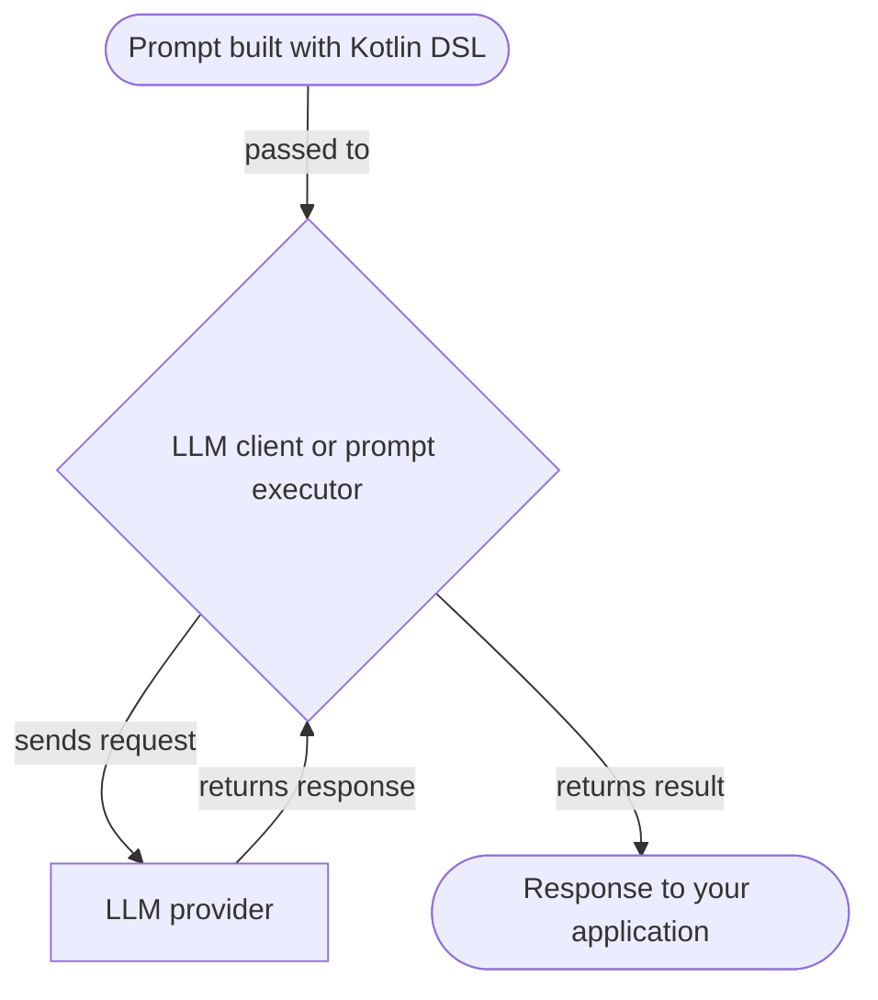
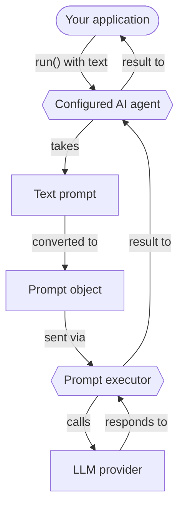

# 提示詞

提示詞是用於大型語言模型 (LLM) 的指令，引導它們生成回應。
它們定義了您與 LLM 互動的內容和結構。
本節說明如何使用 Koog 建立和執行提示詞。

## 建立提示詞

在 Koog 中，所有提示詞都表示為 [**Prompt**](https://api.koog.ai/prompt/prompt-model/ai.koog.prompt.dsl/-prompt/index.html) 物件。一個 Prompt 物件包含：

- **ID**：提示詞的唯一識別碼。
- **Messages**：代表與 LLM 對話的訊息列表。
- **Parameters**：可選的 [LLM 設定參數](https://api.koog.ai/prompt/prompt-model/ai.koog.prompt.params/-l-l-m-params/index.html) (例如 temperature、tool choice 及其他)。

所有 Prompt 物件都是使用 Kotlin DSL 定義的結構化提示詞，讓您可以指定對話的結構。

!!! note
    AI 代理程式讓您可以提供簡單的文字提示詞，而無需建立 Prompt 物件。
    它們會自動將文字提示詞轉換為 Prompt 物件，並將其傳送給 LLM 執行。
    這對於只需要執行單一請求的 [基本代理程式](basic-agents.md) 很有用。

<div class="grid cards" markdown>

-   :material-code-braces:{ .lg .middle } [**結構化提示詞**](structured-prompts.md)

    ---

    建立型別安全的結構化提示詞，用於複雜的多輪對話。

-   :material-multimedia:{ .lg .middle } [**多模態輸入**](multimodal-inputs.md)

    ---

    在結構化提示詞中，與文字一起傳送圖像、音訊、視訊和文件。

</div>

## 執行提示詞

Koog 提供兩種抽象層級來針對 LLM 執行提示詞：LLM client 和 prompt executor。
它們只接受 Prompt 物件，可用於直接執行提示詞，無需 AI 代理程式。
client 和 executor 的執行流程相同：



<div class="grid cards" markdown>

-   :material-arrow-right-bold:{ .lg .middle } [**LLM client**](llm-clients.md)

    ---

    用於與特定 LLM provider 直接互動的低階介面。
    當您使用單一 provider 且不需要進階生命週期管理時使用。

-   :material-swap-horizontal:{ .lg .middle } [**Prompt executor**](prompt-executors.md)

    ---

    管理一個或多個 LLM client 生命週期的上層抽象。
    當您需要統一的 API 來跨多個 provider 執行提示詞，並支援它們之間的動態切換和備援時使用。

</div>

如果您想要執行一個簡單的文字提示詞，可以使用 Kotlin DSL 將其包裝成 Prompt 物件，或者使用 AI 代理程式，它會自動為您完成此操作。
以下是代理程式的執行流程：



<!--- INCLUDE
import ai.koog.agents.core.agent.AIAgent
import ai.koog.prompt.executor.clients.openai.OpenAIModels
import ai.koog.prompt.executor.llms.all.simpleOpenAIExecutor
import kotlinx.coroutines.runBlocking

val apiKey = System.getenv("OPENAI_API_KEY")

fun main() = runBlocking {
-->
<!--- SUFFIX
}
-->
```kotlin
// Create an agent
val agent = AIAgent(
    promptExecutor = simpleOpenAIExecutor(apiKey),
    llmModel = OpenAIModels.Chat.GPT4o
)

// Run the agent
val result = agent.run("What is Koog?")
```
<!--- KNIT example-prompts-01.kt -->

## 最佳化效能與處理故障

Koog 允許您在執行提示詞時最佳化效能並處理故障。

<div class="grid cards" markdown>

-   :material-cached:{ .lg .middle } [**LLM 回應快取**](llm-response-caching.md)

    ---

    快取 LLM 回應以最佳化效能並降低重複請求的成本。

-   :material-shield-check:{ .lg .middle } [**處理故障**](handling-failures.md)

    ---

    在您的應用程式中使用內建的重試、逾時和其他錯誤處理機制。

</div>