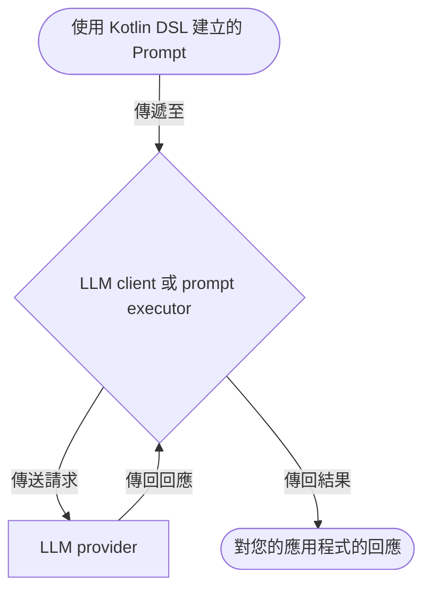
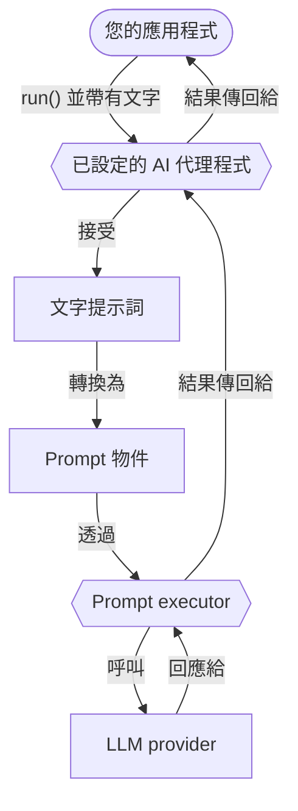

# 提示詞

提示詞是用於大型語言模型 (LLM) 的指令，引導它們生成回應。
它們定義了您與 LLM 互動的內容和結構。
本節說明如何在 Koog 中建立和執行提示詞。

## 建立提示詞

在 Koog 中，提示詞是 [**Prompt**](https://api.koog.ai/prompt/prompt-model/ai.koog.prompt.dsl/-prompt/index.html) data class 的實例，具有以下屬性：

- `id`: 提示詞的唯一識別碼。
- `messages`: 代表與 LLM 對話的訊息列表。
- `params`: 可選的 [LLM 設定參數](prompt-creation/index.md#prompt-parameters) (例如 temperature、tool choice 及其他)。

雖然您可以直接實例化 `Prompt` 類別，
但建議使用 [Kotlin DSL](prompt-creation/index.md) 來建立提示詞，
它提供了一種結構化的方式來定義對話。

<!--- INCLUDE
import ai.koog.prompt.dsl.prompt
-->
```kotlin
val myPrompt = prompt("hello-koog") {
    system("You are a helpful assistant.")
    user("What is Koog?")
}
```
<!--- KNIT example-prompts-01.kt -->

!!! note
    AI 代理程式可以將簡單的文字提示詞作為輸入。
    它們會自動將文字提示詞轉換為 Prompt 物件，並將其傳送給 LLM 執行。
    這對於只需要執行單一請求且不需要複雜對話邏輯的 [基本代理程式](../basic-agents.md) 很有用。

## 執行提示詞

Koog 提供了兩種針對 LLM 執行提示詞的抽象層級：LLM client 和 prompt executor。
兩者都接受 Prompt 物件，可用於直接執行提示詞，無需 AI 代理程式。
client 和 executor 的執行流程相同：



<div class="grid cards" markdown>

-   :material-arrow-right-bold:{ .lg .middle } [**LLM client**](llm-clients.md)

    ---

    用於與特定 LLM provider 直接互動的低階介面。
    當您使用單一 provider 且不需要進階生命週期管理時使用。

-   :material-swap-horizontal:{ .lg .middle } [**Prompt executor**](prompt-executors.md)

    ---

    管理一個或多個 LLM client 生命週期的上層抽象。
    當您需要統一的 API 來跨多個 provider 執行提示詞，
    並支援它們之間的動態切換和備援時使用。

</div>

## 最佳化效能與處理故障

Koog 允許您在執行提示詞時最佳化效能並處理故障。

<div class="grid cards" markdown>

-   :material-cached:{ .lg .middle } [**LLM 回應快取**](llm-response-caching.md)

    ---

    快取 LLM 回應以最佳化效能並降低重複請求的成本。

-   :material-shield-check:{ .lg .middle } [**處理故障**](handling-failures.md)

    ---

    在您的應用程式中使用內建的重試、逾時和其他錯誤處理機制。

</div>

## AI 代理程式中的提示詞

在 Koog 中，AI 代理程式在其生命週期中維護並管理提示詞。
雖然 LLM client 或 executor 用於執行提示詞，但代理程式會處理提示詞更新的流程，
確保對話歷史保持相關且一致。

代理程式中的提示詞生命週期通常包括幾個階段：

1. 初始提示詞設定。
2. 自動提示詞更新。
3. 上下文視窗管理。
4. 手動提示詞管理。

### 初始提示詞設定

當您 [初始化一個代理程式](../getting-started/#create-and-run-an-agent) 時，您會定義
一個 [系統訊息](prompt-creation/index.md#system-message) 來設定代理程式的行為。
然後，當您呼叫代理程式的 `run()` 方法時，您通常會提供一個初始的 [使用者訊息](prompt-creation/index.md#user-messages)
作為輸入。這些訊息共同構成了代理程式的初始提示詞。例如：

<!--- INCLUDE
import ai.koog.agents.core.agent.AIAgent
import ai.koog.prompt.executor.clients.openai.OpenAIModels
import ai.koog.prompt.executor.llms.all.simpleOpenAIExecutor
import kotlinx.coroutines.runBlocking

val apiKey = System.getenv("OPENAI_API_KEY")

fun main() = runBlocking {
-->
<!--- SUFFIX
}
-->
```kotlin
// 建立代理程式
val agent = AIAgent(
    promptExecutor = simpleOpenAIExecutor(apiKey),
    systemPrompt = "You are a helpful assistant.",
    llmModel = OpenAIModels.Chat.GPT4o
)

// 執行代理程式
val result = agent.run("What is Koog?")
```
<!--- KNIT example-prompts-02.kt -->

在此範例中，代理程式會自動將文字提示詞轉換為 Prompt 物件，並將其傳送給 prompt executor：



對於更 [進階的配置](../complex-workflow-agents.md#4-configure-the-agent)，您還可以使用
[AIAgentConfig](https://api.koog.ai/agents/agents-core/ai.koog.agents.core.agent.config/-a-i-agent-config/index.html)
來定義代理程式的初始提示詞。

### 自動提示詞更新

當代理程式執行其策略時，[預定義的節點](../nodes-and-components.md) 會自動更新提示詞。
例如：

- [`nodeLLMRequest`](../nodes-and-components/#nodellmrequest)：將使用者訊息附加到提示詞並擷取 LLM 回應。
- [`nodeLLMSendToolResult`](../nodes-and-components/#nodellmsendtoolresult)：將工具執行結果附加到對話中。
- [`nodeAppendPrompt`](../nodes-and-components/#nodeappendprompt)：在工作流程的任何時間點將特定訊息插入提示詞中。

### 上下文視窗管理

為了避免在長時間運行的互動中超出 LLM 上下文視窗，代理程式可以使用
[歷史壓縮](../history-compression.md) 功能。

### 手動提示詞管理

對於複雜的工作流程，您可以使用 [LLM session](../sessions.md) 手動管理提示詞。
在代理程式策略或自訂節點中，您可以使用 `llm.writeSession` 來存取和變更 `Prompt` 物件。
這讓您可以根據需要新增、移除或重新排序訊息。