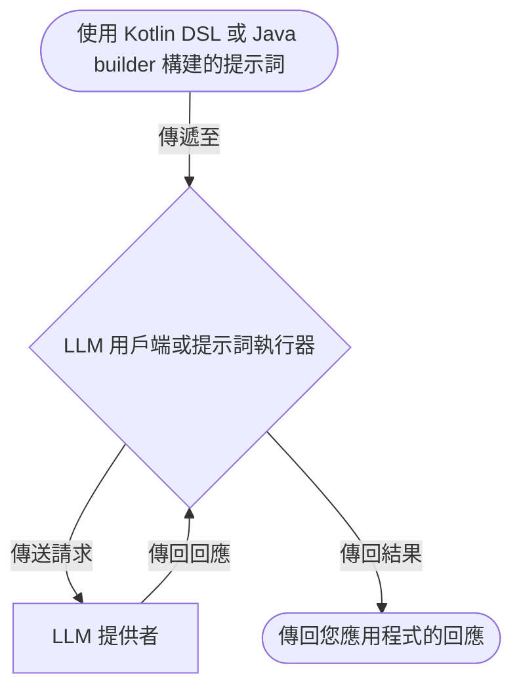
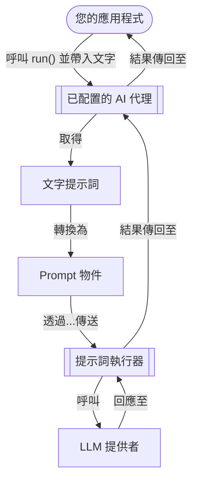

# 提示詞 (Prompts)

提示詞 (Prompts) 是引導大型語言模型 (LLMs) 產生回應的指示。
它們定義了您與 LLMs 互動的內容與結構。
本節說明如何使用 Koog 建立與執行提示詞。

## 建立提示詞

在 Koog 中，提示詞是 [**Prompt**](api:prompt-model::ai.koog.prompt.dsl.Prompt) 資料類別的執行個體 (instances)，具有以下屬性：

- `id`：提示詞的唯一識別碼。
- `messages`：代表與 LLM 對話的訊息清單。
- `params`：選用的 [LLM 配置參數](prompt-creation/index.md#prompt-parameters)（例如溫度 (temperature)、工具選擇等）。

雖然您可以直接具現化 `Prompt` 類別，但建議的提示詞建立方式是使用 [Kotlin DSL](prompt-creation/index.md) 或 Java builder API，它們提供了一種結構化的方式來定義對話。

!!! note
    本頁面的 Kotlin 範例使用 Kotlin DSL。Java 範例使用 `Prompt.builder("id")` builder，並搭配明確的方法，例如 `system(...)`、`user(...)`、`assistant(...)`、`toolCall(...)`、`toolResult(...)`，以及在適用情況下使用 `withOutput(Foo.class)`。

=== "Kotlin"

    <!--- INCLUDE
    import ai.koog.prompt.dsl.prompt
    -->
    ```kotlin
    val myPrompt = prompt("hello-koog") {
        system("You are a helpful assistant.")
        user("What is Koog?")
    }
    ```
    <!--- KNIT example-prompts-01.kt -->

=== "Java"

    <!--- INCLUDE
    /**
    -->
    <!--- SUFFIX
    **/
    -->
    ```java
    var myPrompt = Prompt.builder("hello-koog")
        .system("You are a helpful assistant.")
        .user("What is Koog?")
        .build();
    ```
    <!--- KNIT example-prompts-java-01.java -->

!!! note
    AI 代理 (AI agents) 可以接受簡單的文字提示作為輸入。
    它們會自動將文字提示轉換為 Prompt 物件，並將其發送到 LLM 執行。
    這對於僅需執行單次請求且不需要複雜對話邏輯的 [基礎代理](../agents/basic-agents.md) 非常有用。

## 執行提示詞

Koog 為針對 LLMs 執行提示詞提供了兩層抽象：LLM 用戶端 (LLM clients) 與提示詞執行器 (prompt executors)。
兩者皆接受 Prompt 物件，且可用於直接執行提示詞，而無需透過 AI 代理。
兩者的執行流程相同：


```mermaid
flowchart TB
    A([使用 Kotlin DSL 或 Java builder 構建的提示詞])
    B{LLM 用戶端或提示詞執行器}
    C[LLM 提供者]
    D([傳回您應用程式的回應])

    A -->|"傳遞至"| B
    B -->|"傳送請求"| C
    C -->|"傳回回應"| B
    B -->|"傳回結果"| D
```
<!--- KNIT example-prompts-01.txt -->

<div class="grid cards" markdown>

-   :material-arrow-right-bold:{ .lg .middle } [**LLM 用戶端 (LLM clients)**](llm-clients.md)

    ---

    用於與特定 LLM 提供者直接互動的底層介面。
    當您使用單一提供者且不需要進階生命週期管理時，請使用它們。

-   :material-swap-horizontal:{ .lg .middle } [**提示詞執行器 (Prompt executors)**](prompt-executors.md)

    ---

    管理一個或多個 LLM 用戶端生命週期的管理高層抽象。
    當您需要統一的 API 來跨多個提供者執行提示詞，並在其間進行動態切換與備援 (fallbacks) 時，請使用它們。

</div>

## 最佳化效能與處理失敗

Koog 允許您在執行提示詞時最佳化效能並處理失敗。

<div class="grid cards" markdown>

-   :material-cached:{ .lg .middle } [**LLM 回應快取**](llm-response-caching.md)

    ---

    快取 LLM 回應以最佳化效能，並減少重複請求的成本。

-   :material-shield-check:{ .lg .middle } [**處理失敗**](handling-failures.md)

    ---

    在您的應用程式中使用內建的重試、逾時和其他錯誤處理機制。

</div>

## AI 代理中的提示詞

在 Koog 中，AI 代理會在生命週期中維護並管理提示詞。
雖然 LLM 用戶端或執行器用於執行提示詞，但代理負責處理提示詞更新的流程，確保對話歷程記錄保持相關性與一致性。

代理中的提示詞生命週期通常包含幾個階段：

1. 初始提示詞設定。
2. 自動提示詞更新。
3. 上下文視窗管理。
4. 手動提示詞管理。

### 初始提示詞設定

當您 [初始化代理](../quickstart.md#create-your-first-koog-agent) 時，您可以定義一個 [系統訊息 (system message)](prompt-creation/index.md#system-message) 來設定代理的行為。
接著，當您呼叫代理的 `run()` 方法時，通常會提供一個初始 [使用者訊息 (user message)](prompt-creation/index.md#user-messages) 作為輸入。
這些訊息共同構成了代理的初始提示詞。例如：

=== "Kotlin"

    <!--- INCLUDE
    import ai.koog.agents.core.agent.AIAgent
    import ai.koog.prompt.executor.clients.openai.OpenAIModels
    import ai.koog.prompt.executor.llms.all.simpleOpenAIExecutor
    import kotlinx.coroutines.runBlocking
    val apiKey = System.getenv("OPENAI_API_KEY")
    fun main() = runBlocking {
    -->
    <!--- SUFFIX
    }
    -->
    ```kotlin
    // 建立代理
    val agent = AIAgent(
        promptExecutor = simpleOpenAIExecutor(apiKey),
        systemPrompt = "You are a helpful assistant.",
        llmModel = OpenAIModels.Chat.GPT4o
    )
    
    // 執行代理
    val result = agent.run("What is Koog?")
    ```
    <!--- KNIT example-prompts-02.kt -->

=== "Java"

    <!--- INCLUDE
    /**
    -->
    <!--- SUFFIX
    **/
    -->
    ```java
    AIAgent<String, String> agent = AIAgent.builder()
        .promptExecutor(simpleOpenAIExecutor(System.getenv("OPENAI_API_KEY")))
        .systemPrompt("You are a helpful assistant. Answer user questions concisely.")
        .llmModel(OpenAIModels.Chat.GPT4o)
        .build();

    var result = agent.run("What is Koog?");
    ```
    <!--- KNIT example-prompts-java-02.java -->

在此範例中，代理會自動將文字提示轉換為 Prompt 物件，並將其傳送至提示詞執行器：


```mermaid
flowchart TB
    A([您的應用程式])
    B[[已配置的 AI 代理]]
    C["文字提示詞"]
    D["Prompt 物件"]
    E[[提示詞執行器]]
    F[LLM 提供者]

    A -->|"呼叫 run() 並帶入文字"| B
    B -->|"取得"| C
    C -->|"轉換為"| D
    D -->|"透過...傳送"| E
    E -->|"呼叫"| F
    F -->|"回應至"| E
    E -->|"結果傳回至"| B
    B -->|"結果傳回至"| A
```
<!--- KNIT example-prompts-02.txt -->

對於更進階的配置，您也可以使用 [AIAgentConfig](api:agents-core::ai.koog.agents.core.agent.config.AIAgentConfig) 來定義代理的初始提示詞。

### 自動提示詞更新

當代理執行其策略時，[預定義節點](../nodes-and-components.md) 會自動更新提示詞。
例如：

- [`nodeLLMRequest`](../nodes-and-components.md#nodellmrequest)：將使用者訊息附加到提示詞中，並擷取 LLM 回應。
- [`nodeLLMSendToolResult`](../nodes-and-components.md#nodellmsendtoolresult)：將工具執行結果附加到對話中。
- [`nodeAppendPrompt`](../nodes-and-components.md#nodeappendprompt)：在工作流程中的任何位置將特定訊息插入提示詞中。

### 上下文視窗管理

為了避免在長時間互動中超過 LLM 上下文視窗限制，代理可以使用 [歷程記錄壓縮 (history compression)](../history-compression.md) 功能。

### 手動提示詞管理

對於複雜的工作流程，您可以使用 [LLM 工作階段 (LLM sessions)](../sessions.md) 手動管理提示詞。
在代理策略或自訂節點中，您可以使用 `llm.writeSession` 來存取與更改 `Prompt` 物件。
這讓您可以根據需要新增、移除或重新排序訊息。