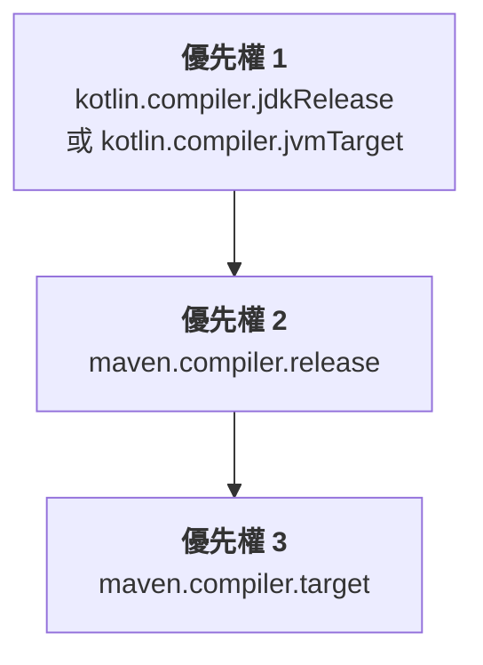

[//]: # (title: 設定 Maven 專案)

當您將 Kotlin 引入現有的 Java Maven 專案或建立新的 Kotlin Maven 專案時，您需要新增用於編譯 Kotlin 原始碼與模組的 Kotlin Maven 外掛程式。

目前僅支援 Maven v3。

## 自動設定

您可以使用 `<extensions>` 選項簡化混合 Java-Kotlin 專案以及純 Kotlin 專案中的 Maven 設定。這種方法可以節省您的時間，因為您不需要手動設定 Maven 編譯器外掛程式。

若要套用帶有 `<extensions>` 的 Kotlin Maven 外掛程式，請按照以下方式更新您的 `pom.xml` 建置檔案：

1. 在 `<properties>` 區塊中，定義 Kotlin 與 JVM 的目標版本：

   ```xml
   <properties>
       <maven.compiler.release>17</maven.compiler.release>
       <kotlin.version>%kotlinVersion%</kotlin.version>
   </properties>
   ```

2. 在 `<build><plugins>` 區塊中，新增啟用 `<extensions>` 選項的 Kotlin Maven 外掛程式：

   ```xml
   <build>
       <plugins>
           <!-- Kotlin 編譯器外掛程式配置 -->
           <plugin>
               <groupId>org.jetbrains.kotlin</groupId>
               <artifactId>kotlin-maven-plugin</artifactId>
               <version>${kotlin.version}</version>
               <extensions>true</extensions> <!-- 啟用此擴充套件 -->
           </plugin>
           <!-- 使用 extensions 時不需要設定 Maven 編譯器外掛程式 -->
       </plugins>
   </build>
   ```

`<extensions>` 選項會執行以下操作：

* 如果 `src/main/kotlin` 與 `src/test/kotlin` 目錄已經存在，但未在外掛程式配置中指定，則自動將其註冊為原始碼根目錄。
* 如果專案中尚未定義 [`kotlin-stdlib` 相依性](maven-set-dependencies.md#dependency-on-the-standard-library)，則自動新增。
* 將 `compile`、`test-compile`、`kapt` 與 `test-kapt` 的執行新增至您的組建中，並繫結至適當的 [生命週期階段](https://maven.apache.org/guides/introduction/introduction-to-the-lifecycle.html)。因此，您不需要手動為 `kapt`、Kotlin 的 `compile` 以及 Java 的 `compile` 執行設定帶有 `<id>` 與 `<goals>` 的 `<executions>` 區塊，即可確保它們以正確的順序執行。
* [自動將 JVM 目標版本與專案中配置的 Java 編譯器版本對齊。](#jvm-target-version)
   
如果您擁有混合 Java 與 Kotlin 的專案，此配置可確保：

* Kotlin 程式碼優先編譯。
* Java 程式碼在 Kotlin 之後編譯，並可以參考 Kotlin 類別。
* 預設的 Maven 行為不會覆蓋外掛程式順序。

擴充套件配置會取代整個 `<executions>` 區塊。如果您需要配置執行，請參閱 [編譯 Kotlin 與 Java 原始碼](#compile-kotlin-and-java-sources) 中的範例。

> 如果有多個建置外掛程式覆寫了預設生命週期，且您也啟用了 `<extensions>` 選項，則 `<build>` 區塊中的最後一個外掛程式在生命週期設定上具有優先權。所有先前對生命週期設定的變更都將被忽略。
>
{style="note"}

### JVM 目標版本

`<extensions>` 選項可確保 Kotlin 與 Maven 編譯器以相同的位元組碼版本為目標。

Kotlin Maven 外掛程式會按照以下順序自動解析 JVM 目標版本：



#### Kotlin 編譯器版本

如果專案中定義了 `kotlin.compiler.jdkRelease` 或 `kotlin.compiler.jvmTarget` 屬性，則該版本具有優先權。

請記住，這些 Kotlin 編譯器選項的行為有所不同：

| Kotlin 編譯器選項 | 控制輸出的位元組碼版本 | 將 API 限制在指定的 JDK |
|------------------------------|-----------------------------------------|-----------------------------------------------------------------------------------------------|
| `kotlin.compiler.jvmTarget`  | 是 | 對程式碼中的 JDK API 沒有限制 |
| `kotlin.compiler.jdkRelease` | 是 | 是 － 僅允許特定的 API 版本（相當於 Java 的 `--release` 編譯器選項） |

> 請勿同時為 `kotlin.compiler.jdkRelease` 與 `kotlin.compiler.jvmTarget` 設定不同的 JDK 選項。否則會產生錯誤。
>
{style="note"}

#### Maven 編譯器版本

* 如果既未設定 `kotlin.compiler.jdkRelease` 也未設定 `kotlin.compiler.jvmTarget` 選項，外掛程式將採用 `maven.compiler.release` 版本。

  `maven.compiler.release` 版本可以定義為專案屬性，也可以在 `maven-compiler-plugin` 配置中定義。
* 如果未設定 Maven 的 release 版本，外掛程式將採用 `maven.compiler.target` 版本。

  它可以定義為專案屬性，也可以在 `maven-compiler-plugin` 配置中定義。

請記住，Maven 編譯器的 `target` 與 `release` 選項行為有所不同：

| Maven 編譯器選項 | 設定 Kotlin 的 `jvmTarget` | 設定 Kotlin 的 `jdkRelease` | 將 API 限制在指定的 JDK |
|--------------------------|---------------------------|----------------------------|----------------------------------------------|
| `maven.compiler.target`  | 是 | 否 | 否 － 組建的 JDK 類別路徑保持可見 |
| `maven.compiler.release` | 是 | 是 | 是 － 僅限於特定的 API 版本 |

> `<extensions>` 選項僅檢查專案級別的屬性與全域 `maven-compiler-plugin` 配置。它不會檢查外掛程式 `<executions>` 區塊中定義的配置。
>
{style="note"}

### Maven 編譯器版本

目前，與 `<extensions>` 搭配使用的 Maven 編譯器外掛程式預設版本為 **%mavenExtensionsVersion%**。您可以單獨設定不同的版本：

```xml
<build>
    <plugins>
        <!-- Kotlin 編譯器外掛程式配置 -->
        <plugin>
            <groupId>org.jetbrains.kotlin</groupId>
            <artifactId>kotlin-maven-plugin</artifactId>
            <version>${kotlin.version}</version>
            <extensions>true</extensions>
        </plugin>
        <!-- 用於 Java 類別的 Maven 編譯器外掛程式配置 -->
        <plugin>
            <groupId>org.apache.maven.plugins</groupId>
            <artifactId>maven-compiler-plugin</artifactId>
            <version>%mavenPluginVersion%</version>
        </plugin>
    </plugins>
</build>
```

## 手動設定

若不啟用 Kotlin Maven 外掛程式中的 `<extensions>`，您需要手動配置專案以確保原始碼正確編譯。

您可以配置您的 Maven 專案來編譯 [Java 與 Kotlin 原始碼的組合](#compile-kotlin-and-java-sources) 或 [純 Kotlin 原始碼](#compile-kotlin-only-sources)。

### 編譯 Kotlin 與 Java 原始碼

若要編譯同時包含 Kotlin 與 Java 原始檔的專案，請確保 Kotlin 編譯器在 Java 編譯器之前執行。

在 Kotlin 宣告被編譯成 `.class` 檔案之前，Java 編譯器無法看見它們。如果您的 Java 程式碼使用了 Kotlin 類別，則必須先編譯這些類別以避免 `cannot find symbol` 錯誤。

Maven 根據兩個主要因素決定外掛程式執行順序：

* `pom.xml` 檔案中外掛程式宣告的順序。
* 內建的預設執行（例如 `default-compile` 與 `default-testCompile`），無論它們在 `pom.xml` 檔案中的位置為何，它們總是在使用者定義的執行之前執行。

若要控制執行順序：

* 在 `maven-compiler-plugin` 之前宣告 `kotlin-maven-plugin`。
* 停用 Java 編譯器外掛程式的預設執行。
* 新增自訂執行以明確控制編譯階段。

> 您可以在 Maven 中使用特殊的 `none` 階段來停用預設執行。
>
{style="note"}

若要套用 Kotlin Maven 外掛程式，請按照以下方式更新您的 `pom.xml` 建置檔案：

```xml
<build>
    <plugins>
        <!-- Kotlin 編譯器外掛程式配置 -->
        <plugin>
            <groupId>org.jetbrains.kotlin</groupId>
            <artifactId>kotlin-maven-plugin</artifactId>
            <version>${kotlin.version}</version>
            <executions>
                <execution>
                    <id>kotlin-compile</id>
                    <phase>compile</phase>
                    <goals>
                        <goal>compile</goal>
                    </goals>
                    <configuration>
                        <sourceDirs>
                            <sourceDir>src/main/kotlin</sourceDir>
                            <!-- 確保 Kotlin 程式碼可以參考 Java 程式碼 -->
                            <sourceDir>src/main/java</sourceDir>
                        </sourceDirs>
                    </configuration>
                </execution>
                <execution>
                    <id>kotlin-test-compile</id>
                    <phase>test-compile</phase>
                    <goals>
                        <goal>test-compile</goal>
                    </goals>
                    <configuration>
                        <sourceDirs>
                            <sourceDir>src/test/kotlin</sourceDir>
                            <sourceDir>src/test/java</sourceDir>
                        </sourceDirs>
                    </configuration>
                </execution>
            </executions>
        </plugin>

        <!-- Maven 編譯器外掛程式配置 -->
        <plugin>
            <groupId>org.apache.maven.plugins</groupId>
            <artifactId>maven-compiler-plugin</artifactId>
            <version>3.15.0</version>
            <executions>
                <!-- 停用預設執行 -->
                <execution>
                    <id>default-compile</id>
                    <phase>none</phase>
                </execution>
                <execution>
                    <id>default-testCompile</id>
                    <phase>none</phase>
                </execution>

                <!-- 定義自訂執行 -->
                <execution>
                    <id>java-compile</id>
                    <phase>compile</phase>
                    <goals>
                        <goal>compile</goal>
                    </goals>
                </execution>
                <execution>
                    <id>java-test-compile</id>
                    <phase>test-compile</phase>
                    <goals>
                        <goal>testCompile</goal>
                    </goals>
                </execution>
            </executions>
        </plugin>
    </plugins>
</build>
```

此配置可確保：

* Kotlin 程式碼優先編譯。
* Java 程式碼在 Kotlin 之後編譯，並可以參考 Kotlin 類別。
* 預設的 Maven 行為不會覆蓋外掛程式順序。

如需更多關於 Maven 如何處理外掛程式執行的詳細資訊，請參閱 Maven 官方文件中的 [預設外掛程式執行 ID 指南](https://maven.apache.org/guides/mini/guide-default-execution-ids.html)。

### 編譯純 Kotlin 原始碼

若要編譯僅包含 Kotlin 原始檔的專案，請宣告原始碼根目錄並配置 Kotlin Maven 外掛程式：

1. 在 `<build>` 區塊中指定原始碼目錄：

    ```xml
    <build>
        <sourceDirectory>src/main/kotlin</sourceDirectory>
        <testSourceDirectory>src/test/kotlin</testSourceDirectory>
    </build>
    ```

2. 確保套用了 Kotlin Maven 外掛程式：

    ```xml
    <build>
        <plugins>
            <plugin>
                <groupId>org.jetbrains.kotlin</groupId>
                <artifactId>kotlin-maven-plugin</artifactId>
                <version>${kotlin.version}</version>
                <executions>
                    <execution>
                        <id>compile</id>
                        <goals>
                            <goal>compile</goal>
                        </goals>
                    </execution>
                    <execution>
                        <id>test-compile</id>
                        <goals>
                            <goal>test-compile</goal>
                        </goals>
                    </execution>
                </executions>
            </plugin>
        </plugins>
    </build>
    ```

### 設定 JDK 版本

Kotlin 支援 [Maven 工具鏈 (Toolchains)](https://maven.apache.org/guides/mini/guide-using-toolchains.html)，可協助您管理組建中的 JDK 版本。

如果您在組建中配置了 `maven-toolchains-plugin`，則可以指定用於 Kotlin 編譯的 JDK 版本，該版本獨立於執行 Maven 的 JVM 版本（於 `JAVA_HOME` 路徑中設定）。隨後 Kotlin Maven 外掛程式會自動採用選定的 JDK 工具鏈。

這允許您配置單個工具鏈來控制整個組建中所有外掛程式使用的 JDK，包括 Kotlin 編譯。例如：

```xml
<plugin>
    <groupId>org.apache.maven.plugins</groupId>
    <artifactId>maven-toolchains-plugin</artifactId>
    <version>3.2.0</version>
    <executions>
        <execution>
            <goals>
                <goal>toolchain</goal>
            </goals>
        </execution>
    </executions>
    <configuration>
        <toolchains>
            <jdk>
                <version>21</version>
            </jdk>
        </toolchains>
    </configuration>
</plugin>
```

請記住設定 JDK 版本的不同方式之優先權：

```Mermaid
graph TD
    A["<b>優先權 1</b><br/>kotlin-maven-plugin 的 jdkHome 選項"]
    B["<b>優先權 2</b><br/>maven-toolchains-plugin 中<br/>設定的 JDK 版本"]
    C["<b>優先權 3</b><br/>JAVA_HOME 版本"]

    A --> B
    B --> C
```

* 在 `kotlin-maven-plugin` 配置的 `jdkHome` 選項中設定的 JDK 版本，其優先權始終高於工具鏈版本。
* `maven-toolchains-plugin` 中的 JDK 版本會覆蓋 `JAVA_HOME` 路徑中設定的 JDK 版本。

您也可以使用外掛程式專用的 `<jdkToolchain>` 選項，直接在 `kotlin-maven-plugin` 的工具鏈中設定 JDK 版本。與使用 `maven-toolchains-plugin` 相比，此參數僅影響 Kotlin 編譯，對組建中的其他外掛程式沒有影響。

> 目前，配置 `maven-toolchains-plugin` 以使用特定 JDK 版本[不會影響 `kotlin-maven-plugin` 的 `kapt` 與 `test-kapt` 目標](https://youtrack.jetbrains.com/issue/KT-79897)。請改在 `JAVA_HOME` 路徑中設定所需的版本。
>
{style="note"}

#### 使用 JDK 17

若要使用 JDK 17，請在您的 `.mvn/jvm.config` 檔案中新增：

```none
--add-opens=java.base/java.lang=ALL-UNNAMED
--add-opens=java.base/java.io=ALL-UNNAMED
```

## 接下來要做什麼？

[在您的 Kotlin Maven 專案中設定相依性](maven-set-dependencies.md)