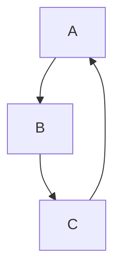
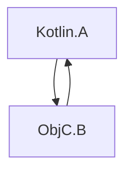

[//]: # (title: 與 Swift/Objective-C ARC 的整合)

Kotlin 和 Objective-C 使用不同的記憶體管理策略。Kotlin 具有追蹤垃圾回收器，而 Objective-C 則依賴於自動參考計數 (ARC)。

這些策略之間的整合通常是無縫的，並且通常不需要額外的工作。然而，您應該記住一些具體事項：

## 執行緒

### 解初始化器

如果 Swift/Objective-C 物件及其引用的物件在主執行緒上傳遞給 Kotlin，則這些物件的解初始化會主執行緒上被呼叫，例如：

```kotlin
// Kotlin
class KotlinExample {
    fun action(arg: Any) {
        println(arg)
    }
}
```

```swift
// Swift
class SwiftExample {
    init() {
        print("init on \(Thread.current)")
    }

    deinit {
        print("deinit on \(Thread.current)")
    }
}

func test() {
    KotlinExample().action(arg: SwiftExample())
}
```

結果輸出：

```text
init on <_NSMainThread: 0x600003bc0000>{number = 1, name = main}
shared.SwiftExample
deinit on <_NSMainThread: 0x600003bc0000>{number = 1, name = main}
```

如果發生以下情況，Swift/Objective-C 物件的解初始化將在特殊的 GC 執行緒而非主執行緒上被呼叫：

*   Swift/Objective-C 物件在非主執行緒上傳遞給 Kotlin。
*   主分派佇列 (dispatch queue) 未被處理。

如果您想明確地在特殊的 GC 執行緒上呼叫解初始化，請在您的 `gradle.properties` 中設定 `kotlin.native.binary.objcDisposeOnMain=false`。此選項即使在 Swift/Objective-C 物件是在主執行緒上傳遞給 Kotlin 的情況下，也會啟用在特殊 GC 執行緒上的解初始化。

特殊的 GC 執行緒符合 Objective-C 執行時 (runtime) 的規範，這表示它具有執行迴圈 (run loop) 和自動釋放池 (autorelease pools) 清理機制。

### 完成處理常式

當從 Swift 呼叫 Kotlin 暫停函式時，完成處理常式可能會在非主執行緒上被呼叫，例如：

```kotlin
// Kotlin
// coroutineScope, launch, and delay are from kotlinx.coroutines
suspend fun asyncFunctionExample() = coroutineScope {
    launch {
        delay(1000L)
        println("World!")
    }
    println("Hello")
}
```

```swift
// Swift
func test() {
    print("Running test on \(Thread.current)")
    PlatformKt.asyncFunctionExample(completionHandler: { _ in
        print("Running completion handler on \(Thread.current)")
    })
}
```

結果輸出：

```text
Running test on <_NSMainThread: 0x600001b100c0>{number = 1, name = main}
Hello
World!
Running completion handler on <NSThread: 0x600001b45bc0>{number = 7, name = (null)}
```

## 垃圾回收與生命週期

### 物件回收

物件僅在垃圾回收期間被回收。這適用於跨越互通邊界進入 Kotlin/Native 的 Swift/Objective-C 物件，例如：

```kotlin
// Kotlin
class KotlinExample {
    fun action(arg: Any) {
        println(arg)
    }
}
```

```swift
// Swift
class SwiftExample {
    deinit {
        print("SwiftExample deinit")
    }
}

func test() {
    swiftTest()
    kotlinTest()
}

func swiftTest() {
    print(SwiftExample())
    print("swiftTestFinished")
}

func kotlinTest() {
    KotlinExample().action(arg: SwiftExample())
    print("kotlinTest finished")
}
```

結果輸出：

```text
shared.SwiftExample
SwiftExample deinit
swiftTestFinished
shared.SwiftExample
kotlinTest finished
SwiftExample deinit
```

### Objective-C 物件生命週期

Objective-C 物件的生命週期可能比預期的長，這有時可能導致效能問題。例如，當一個長時間執行的迴圈在每次迭代時創建多個跨越 Swift/Objective-C 互通邊界的暫時物件時。

在 [GC 日誌](native-memory-manager.md#monitor-gc-performance) 中，根集 (root set) 中存在一定數量的穩定引用 (stable refs)。如果這個數字持續增長，可能表示 Swift/Objective-C 物件未能按時釋放。在這種情況下，嘗試將 `autoreleasepool` 區塊放置在執行互通呼叫的迴圈體周圍：

```kotlin
// Kotlin
fun growingMemoryUsage() {
    repeat(Int.MAX_VALUE) {
        NSLog("$it
")
    }
}

fun steadyMemoryUsage() {
    repeat(Int.MAX_VALUE) {
        autoreleasepool {
            NSLog("$it
")
        }
    }
}
```

### Swift 和 Kotlin 物件鏈的垃圾回收

請考慮以下範例：



```kotlin
// Kotlin
interface Storage {
    fun store(arg: Any)
}

class KotlinStorage(var field: Any? = null) : Storage {
    override fun store(arg: Any) {
        field = arg
    }
}

class KotlinExample {
    fun action(firstSwiftStorage: Storage, secondSwiftStorage: Storage) {
        // Here, we create the following chain:
        // firstKotlinStorage -> firstSwiftStorage -> secondKotlinStorage -> secondSwiftStorage.
        val firstKotlinStorage = KotlinStorage()
        firstKotlinStorage.store(firstSwiftStorage)
        val secondKotlinStorage = KotlinStorage()
        firstSwiftStorage.store(secondKotlinStorage)
        secondKotlinStorage.store(secondSwiftStorage)
    }
}
```

```swift
// Swift
class SwiftStorage : Storage {

    let name: String

    var field: Any? = nil

    init(_ name: String) {
        self.name = name
    }

    func store(arg: Any) {
        field = arg
    }

    deinit {
        print("deinit SwiftStorage \(name)")
    }
}

func test() {
    KotlinExample().action(
        firstSwiftStorage: SwiftStorage("first"),
        secondSwiftStorage: SwiftStorage("second")
    )
}
```

在日誌中，「deinit SwiftStorage first」和「deinit SwiftStorage second」訊息之間需要一些時間才會出現。原因是 `firstKotlinStorage` 和 `secondKotlinStorage` 在不同的 GC 週期中被收集。以下是事件序列：

1.  `KotlinExample.action` 完成。`firstKotlinStorage` 被視為「死亡 (dead)」，因為沒有任何東西引用它，而 `secondKotlinStorage` 則不然，因為它被 `firstSwiftStorage` 引用。
2.  第一個 GC 週期開始，`firstKotlinStorage` 被收集。
3.  `firstSwiftStorage` 沒有任何引用，因此它也「死亡 (dead)」，並且呼叫了 `deinit`。
4.  第二個 GC 週期開始。`secondKotlinStorage` 被收集，因為 `firstSwiftStorage` 不再引用它。
5.  `secondSwiftStorage` 最終被回收。

收集這四個物件需要兩個 GC 週期，因為 Swift 和 Objective-C 物件的解初始化發生在 GC 週期之後。此限制源於 `deinit`，它可以呼叫任意程式碼，包括在 GC 暫停期間無法執行的 Kotlin 程式碼。

### 循環引用

在一個 _循環引用_ 中，多個物件使用強引用 (strong references) 以循環方式互相引用：


Kotlin 的追蹤 GC 和 Objective-C 的 ARC 處理循環引用的方式不同。當物件變得不可達時，Kotlin 的 GC 可以正確地回收這些循環，而 Objective-C 的 ARC 則不能。因此，Kotlin 物件的循環引用可以被回收，而 [Swift/Objective-C 物件的循環引用則不能](https://docs.swift.org/swift-book/documentation/the-swift-programming-language/automaticreferencecounting/#Strong-Reference-Cycles-Between-Class-Instances)。

請考慮循環引用同時包含 Objective-C 和 Kotlin 物件的情況：



這涉及到結合 Kotlin 和 Objective-C 的記憶體管理模型，它們無法共同處理（回收）循環引用。這意味著如果至少存在一個 Objective-C 物件，整個物件圖的循環引用將無法被回收，並且無法從 Kotlin 端打破該循環。

不幸的是，目前沒有特殊的工具可以自動檢測 Kotlin/Native 程式碼中的循環引用。為了避免循環引用，請使用 [弱引用 (weak references) 或無主引用 (unowned references)](https://docs.swift.org/swift-book/documentation/the-swift-programming-language/automaticreferencecounting/#Resolving-Strong-Reference-Cycles-Between-Class-Instances)。

## 對背景狀態和 App Extensions 的支援

目前的記憶體管理器預設不會追蹤應用程式狀態，並且不支援 [App Extensions](https://developer.apple.com/app-extensions/) 的開箱即用整合。

這意味著記憶體管理器不會相應地調整 GC 行為，這在某些情況下可能有害。要更改此行為，請將以下 [實驗性 (Experimental)](components-stability.md) 二進位選項添加到您的 `gradle.properties` 中：

```none
kotlin.native.binary.appStateTracking=enabled
```

當應用程式處於背景時，它會關閉基於計時器的垃圾回收器調用，因此 GC 僅在記憶體消耗過高時才被呼叫。

## 接下來

了解更多關於 [Swift/Objective-C 互通性](native-objc-interop.md) 的資訊。