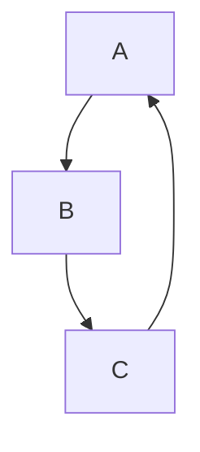
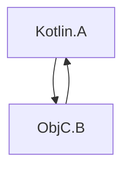

[//]: # (title: 與 Swift/Objective-C ARC 的整合)

Kotlin 與 Objective-C 使用不同的記憶體管理策略。Kotlin 擁有追蹤式垃圾收集器，而 Objective-C 則依賴自動參照計數 (ARC)。

這些策略之間的整合通常是無縫的，且一般不需要額外的工作。然而，仍有一些細節需要注意：

## 執行緒

### Deinitializer

如果 Swift/Objective-C 物件是在主執行緒上傳遞給 Kotlin 的，那麼該物件及其參照物件的 deinitialization (解構) 會在主執行緒上呼叫，例如：

```kotlin
// Kotlin
class KotlinExample {
    fun action(arg: Any) {
        println(arg)
    }
}
```

```swift
// Swift
class SwiftExample {
    init() {
        print("init on \(Thread.current)")
    }

    deinit {
        print("deinit on \(Thread.current)")
    }
}

func test() {
    KotlinExample().action(arg: SwiftExample())
}
```

輸出的結果：

```text
init on <_NSMainThread: 0x600003bc0000>{number = 1, name = main}
shared.SwiftExample
deinit on <_NSMainThread: 0x600003bc0000>{number = 1, name = main}
```

在以下情況下，Swift/Objective-C 物件的 deinitialization 會在特殊的 GC 執行緒而非主執行緒上呼叫：

* Swift/Objective-C 物件是在非主執行緒上傳遞給 Kotlin 的。
* 主分派隊列 (main dispatch queue) 未被處理。

如果你想要明確地在特殊的 GC 執行緒上呼叫 deinitialization，請在你的 `gradle.properties` 中設定 `kotlin.native.binary.objcDisposeOnMain=false`。此選項即使在 Swift/Objective-C 物件於主執行緒傳遞給 Kotlin 的情況下，也會啟用特殊 GC 執行緒上的 deinitialization。

特殊的 GC 執行緒符合 Objective-C 執行階段 (runtime) 規範，這意味著它擁有執行迴圈 (run loop) 並會排空 autorelease pool。

### 完成處理常式

當從 Swift 呼叫 Kotlin 的掛起函式 (suspending function) 時，完成處理常式 (completion handler) 可能會在非主執行緒上被呼叫，例如：

```kotlin
// Kotlin
// coroutineScope, launch, and delay 來自 kotlinx.coroutines
suspend fun asyncFunctionExample() = coroutineScope {
    launch {
        delay(1000L)
        println("World!")
    }
    println("Hello")
}
```

```swift
// Swift
func test() {
    print("Running test on \(Thread.current)")
    PlatformKt.asyncFunctionExample(completionHandler: { _ in
        print("Running completion handler on \(Thread.current)")
    })
}
```

輸出的結果：

```text
Running test on <_NSMainThread: 0x600001b100c0>{number = 1, name = main}
Hello
World!
Running completion handler on <NSThread: 0x600001b45bc0>{number = 7, name = (null)}
```

## 垃圾收集與生命週期

### 物件回收

物件僅在垃圾收集期間被回收。這也適用於跨越互通邊界進入 Kotlin/Native 的 Swift/Objective-C 物件，例如：

```kotlin
// Kotlin
class KotlinExample {
    fun action(arg: Any) {
        println(arg)
    }
}
```

```swift
// Swift
class SwiftExample {
    deinit {
        print("SwiftExample deinit")
    }
}

func test() {
    swiftTest()
    kotlinTest()
}

func swiftTest() {
    print(SwiftExample())
    print("swiftTestFinished")
}

func kotlinTest() {
    KotlinExample().action(arg: SwiftExample())
    print("kotlinTest finished")
}
```

輸出的結果：

```text
shared.SwiftExample
SwiftExample deinit
swiftTestFinished
shared.SwiftExample
kotlinTest finished
SwiftExample deinit
```

### Objective-C 物件生命週期

Objective-C 物件的存活時間可能會超過其應有的長度，這有時可能會導致效能問題。例如，當一個長時間運行的迴圈在每次反覆運算中都建立數個跨越 Swift/Objective-C 互通邊界的暫時物件時。

在 [GC 記錄](native-memory-manager.md#monitor-gc-performance)中，根集合 (root set) 中包含一定數量的穩定參照 (stable refs)。如果此數量持續增長，可能表示 Swift/Objective-C 物件未在應釋放時被釋放。在這種情況下，請嘗試在進行互通呼叫的迴圈主體周圍使用 `autoreleasepool` 區塊：

```kotlin
// Kotlin
fun growingMemoryUsage() {
    repeat(Int.MAX_VALUE) {
        NSLog("$it
")
    }
}

fun steadyMemoryUsage() {
    repeat(Int.MAX_VALUE) {
        autoreleasepool {
            NSLog("$it
")
        }
    }
}
```

### Swift 與 Kotlin 物件鏈的垃圾收集

請考慮以下範例：

```kotlin
// Kotlin
interface Storage {
    fun store(arg: Any)
}

class KotlinStorage(var field: Any? = null) : Storage {
    override fun store(arg: Any) {
        field = arg
    }
}

class KotlinExample {
    fun action(firstSwiftStorage: Storage, secondSwiftStorage: Storage) {
        // 在這裡，我們建立了以下鏈結：
        // firstKotlinStorage -> firstSwiftStorage -> secondKotlinStorage -> secondSwiftStorage.
        val firstKotlinStorage = KotlinStorage()
        firstKotlinStorage.store(firstSwiftStorage)
        val secondKotlinStorage = KotlinStorage()
        firstSwiftStorage.store(secondKotlinStorage)
        secondKotlinStorage.store(secondSwiftStorage)
    }
}
```

```swift
// Swift
class SwiftStorage : Storage {

    let name: String

    var field: Any? = nil

    init(_ name: String) {
        self.name = name
    }

    func store(arg: Any) {
        field = arg
    }

    deinit {
        print("deinit SwiftStorage \(name)")
    }
}

func test() {
    KotlinExample().action(
        firstSwiftStorage: SwiftStorage("first"),
        secondSwiftStorage: SwiftStorage("second")
    )
}
```

在記錄中出現 "deinit SwiftStorage first" 與 "deinit SwiftStorage second" 訊息之間需要一些時間。原因在於 `firstKotlinStorage` 與 `secondKotlinStorage` 是在不同的 GC 週期中被收集的。以下是事件順序：

1. `KotlinExample.action` 結束。`firstKotlinStorage` 被視為「失效」，因為沒有任何東西參照它，而 `secondKotlinStorage` 則不然，因為它被 `firstSwiftStorage` 參照。
2. 第一個 GC 週期開始，`firstKotlinStorage` 被收集。
3. 由於不再有對 `firstSwiftStorage` 的參照，它也變為「失效」，並呼叫 `deinit`。
4. 第二個 GC 週期開始。`secondKotlinStorage` 被收集，因為 `firstSwiftStorage` 不再參照它。
5. `secondSwiftStorage` 最終被回收。

收集這四個物件需要兩個 GC 週期，因為 Swift 與 Objective-C 物件的 deinitialization 是發生在 GC 週期之後。此限制源於 `deinit` 可能呼叫任意程式碼，包括無法在 GC 暫停期間執行的 Kotlin 程式碼。

### 循環參照

在「循環參照 (retain cycle)」中，多個物件使用強參照循環地互相指向：


```mermaid
graph TD
    A --> B
    B --> C
    C --> A
```

Kotlin 的追蹤式 GC 與 Objective-C 的 ARC 處理循環參照的方式不同。當物件變得無法到達時，Kotlin 的 GC 可以正確地回收此類循環，而 Objective-C 的 ARC 則不行。因此，Kotlin 物件的循環參照可以被回收，但 [Swift/Objective-C 物件的循環參照則不行](https://docs.swift.org/swift-book/documentation/the-swift-programming-language/automaticreferencecounting/#Strong-Reference-Cycles-Between-Class-Instances)。

考慮循環參照同時包含 Objective-C 與 Kotlin 物件的情況：


```mermaid
graph TD
    Kotlin.A --> ObjC.B
    ObjC.B --> Kotlin.A
```

這涉及結合 Kotlin 與 Objective-C 的記憶體管理模型，而兩者無法共同處理（回收）循環參照。這意味著如果至少存在一個 Objective-C 物件，則整個物件圖的循環參照都無法被回收，且無法從 Kotlin 端打破該循環。

不幸的是，目前尚無專門的工具可用於自動偵測 Kotlin/Native 程式碼中的循環參照。為了避免循環參照，請使用 [弱參照 (weak reference) 或無主參照 (unowned reference)](https://docs.swift.org/swift-book/documentation/the-swift-programming-language/automaticreferencecounting/#Resolving-Strong-Reference-Cycles-Between-Class-Instances)。

## 支援背景狀態與 App 擴充套件

目前的記憶體管理員預設不會追蹤應用程式狀態，且未開箱即用地與 [App 擴充套件 (App Extensions)](https://developer.apple.com/app-extensions/) 整合。

這意味著記憶體管理員不會相應地調整 GC 行為，這在某些情況下可能是有害的。要更改此行為，請在你的 `gradle.properties` 中添加以下 [實驗性 (Experimental)](components-stability.md) 二進位選項：

```none
kotlin.native.binary.appStateTracking=enabled
```

當應用程式處於背景時，它會關閉基於計時器的垃圾收集器叫用，因此僅在記憶體消耗過高時才會呼叫 GC。

## 下一步

進一步了解 [Swift/Objective-C 互通性](native-objc-interop.md)。